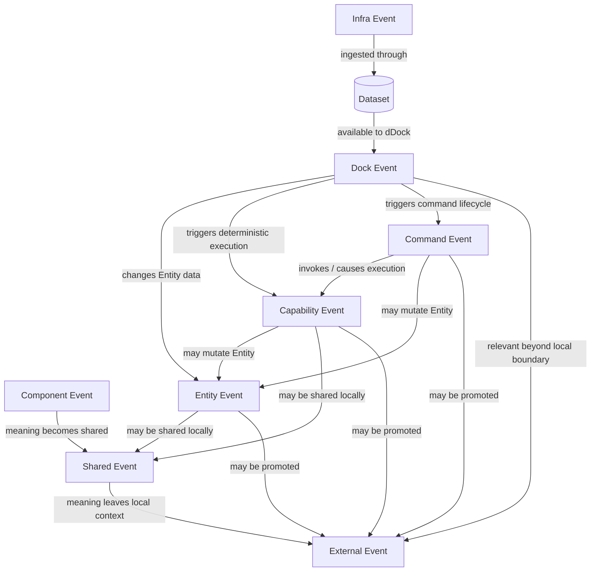

# Event Scopes and Promotion Model

This document consolidates the current Sprint 7 event model and preserves the historical Presentation Layer decisions that led to it.

Historical source: `docs/2026-08-08-interface-presentation-layer-report.md` at commit `257becfe863d942677718f9c80f7593e8efcdc09`.

The historical model used the names `Component Event`, `Presentation Global Event` and `External Event`. During Sprint 7, `Presentation Global Event` was renamed to **Shared Event**. The Sprint 7 model also introduces **Infra Event** and **Dock Event**, incorporates **Entity Event** as the event family associated with changes to Entity data, restores **Capability Event** from historical InfoBIM/OntoBDC work, and introduces **Command Event** provisionally for evaluation during the sprint.

The important principle is that these names describe stages, origins or meanings in event promotion. **External Event is the ultimate promoted state of any event.** It is not a parallel category beside the others.

## 1. Component Event

Meaning: **something happened locally to a component or concrete presentation implementation.**

Examples include click, focus, input, pointer interaction, a physical button press, an encoder turn, a local resize, the end of an animation or another occurrence that belongs to one concrete component/device.

Core rule: **a physical/local occurrence is not automatically a semantic event for the rest of the system.**

A Component Event may die at this level. It is promoted only when its meaning becomes relevant beyond the component.

## 2. Shared Event

Previous name: **Presentation Global Event**.

Meaning: **something happened that matters to more than one participant inside the same local presentation/runtime context.**

The name was shortened because `Presentation Global Event` was unnecessarily long and the important semantic property is that the event is **shared**.

Historical examples include:

- ActionInvoked
- TileSelected
- TileActivated
- EntitySelected
- ContextActivated
- PresentationRequested
- PresentationChanged
- TilePinned
- TileResized
- SurfaceChanged
- NavigationIntent
- ShowDetailsRequested

Current concrete OntoBDC View examples include `entity-selected` and `show-details-requested`.

Core rule: **producers do not need to know their consumers. They publish a Shared Event and interested participants react to the shared semantic contract.**

A Shared Event may remain local. It only becomes External when its meaning must leave that local context.

## 3. Infra Event

Meaning: **an event whose origin is outside OntoBDC.**

Examples include:

- gate/alarm activation;
- time and date occurrences;
- sensor readings;
- presence detection;
- BLE-originated observations;
- equipment state changes;
- environmental measurements;
- other occurrences produced by infrastructure external to OntoBDC.

The mechanism that first observes the real-world occurrence is deliberately not fixed yet. It may be an emitter, adapter, Agent, hardware reader or another integration component.

What is fixed is the ingestion boundary:

**an Infra Event enters OntoBDC through a Dataset.**

Once ingested, the Dataset carries the Infra Event as semantic data inside the OntoBDC context/container.

An Infra Event does not automatically become important to the dDock. It is first available for evaluation.

## 4. Dock Event

Meaning: **an event that the dDock has judged relevant enough to promote from the events available to it.**

A Dock Event is therefore not merely an event stored by the Dock. It is an event whose relevance has been recognized by that dDock.

Typical promotion path:

Infra Event → Dataset → dDock evaluates → Dock Event

The dDock remains without domain intelligence in the sense established by the historical architecture: it is not supposed to become the business-domain brain. However, it is responsible for deciding whether an event available to it is pertinent enough to be promoted into its event flow according to the contracts/policies available to the dDock.

A Dock Event may subsequently lead to Entity data changes, presentation reactions, capability execution, command handling or further promotion.

## 5. Entity Event

Entity Events are documented in detail in `Entity Events.md`.

Meaning: **an event produced by a change to Entity data.**

Typical causes include:

- Entity creation;
- Entity update;
- Entity deletion;
- property/value change;
- relationship change;
- another persisted semantic mutation of an Entity.

Entity Event is not merely a UI notification. It records that the semantic data represented by an Entity changed.

A Dock Event may lead to an Entity Event when the promoted infrastructure/runtime occurrence causes an Entity to change.

Likewise, an Entity Event can arise without an Infra Event; for example, a user or deterministic capability may modify Entity data directly.

## 6. Capability Event

Meaning: **an event emitted by a Capability as part of deterministic execution.**

Capability Events are not new. Historical InfoBIM work explicitly declared capability output events and used them as part of deterministic orchestration. Concrete historical examples include:

- `org.ontobdc.aeco.distribution.flow.pipe.sizing.uhc.suggested`
- `org.ontobdc.aeco.distribution.flow.pipe.sizing.uhc.error`

The historical capability model distinguished events from states: a capability could emit an occurrence such as `...suggested` while also declaring or producing a semantic state such as `...state.sized`.

Core rule: **Capability Event describes what happened as a result of capability execution; it is not the capability itself and it is not the resulting state.**

Possible origins include:

- successful capability execution;
- failed capability execution;
- a granular outcome more meaningful than generic success/failure;
- an intermediate deterministic result that another actor/statechart needs to consume.

A Capability Event may remain internal to deterministic orchestration, may produce Entity Events when persisted Entity data changes, may be shared locally, or may be promoted to External Event when its significance leaves the local runtime boundary.

## 7. Command Event — provisional

Meaning: **an event associated with the receipt, acceptance, execution, rejection or completion of a Command.**

This category is intentionally provisional during Sprint 7. It is being introduced so the architecture can test whether Command lifecycle occurrences deserve their own explicit event family instead of being represented only by generic Capability/Shared/External events.

Possible examples include:

- CommandReceived
- CommandAccepted
- CommandRejected
- CommandExecutionStarted
- CommandExecuted
- CommandFailed

This list is not normative yet.

Core rule for the experiment: **a Command Event describes an occurrence in the lifecycle of a Command; it must not be confused with the Command itself.**

If Sprint 7 shows that this category adds no semantic value or duplicates Capability Events/Shared Events, it should be deleted rather than preserved for symmetry.

## 8. External Event — ultimate promoted state

Meaning: **the event has reached the final promotion level and now matters outside its previous local boundary.**

This is the critical Sprint 7 correction to the older interpretation:

**External Event is the ultimate state to which any event can be promoted.**

It is not one event family beside Infra Event, Dock Event, Entity Event, Capability Event, Command Event or Shared Event.

Any of them may ultimately become External when its meaning requires propagation beyond the current local context.

Examples of possible promotion paths:

- Component Event → Shared Event → External Event
- Infra Event → Dock Event → External Event
- Infra Event → Dock Event → Entity Event → External Event
- Capability Event → Entity Event → External Event
- Capability Event → External Event
- Command Event → Capability Event → External Event
- Command Event → External Event
- Entity Event → External Event
- Shared Event → External Event

Not every event must reach External. Promotion stops wherever the event's meaning stops being relevant.

## 9. Promotion rules

The historical golden rule remains valid and is now applied to the complete Sprint 7 model:

**The event moves up only when its meaning moves up.**

Promotion is semantic, not mechanical.

Examples:

- a click can remain a Component Event;
- an entity selection that several Tiles need can become a Shared Event;
- a sensor reading can remain an Infra Event stored in a Dataset;
- the dDock may promote a relevant Infra Event into a Dock Event;
- a Dock Event that changes persisted Entity state may produce an Entity Event;
- a Capability Event can remain local to deterministic orchestration;
- a Command lifecycle occurrence can remain a Command Event if that distinction proves useful;
- any of those can become External when it must cross the final local boundary.

Serialization, DOM bubbling, persistence or transport availability do not by themselves justify promotion.

## 10. Event paths

### Presentation-originated path

User / local interaction → Component Event → Shared Event → External Event

The Shared step is optional if the occurrence never needs to be shared locally. External promotion occurs only if the event must leave the local context.

### Infrastructure-originated path

External infrastructure occurrence → reader/emitter/adapter → Dataset → Infra Event → dDock evaluation → Dock Event → optional Entity Event / Capability Event / Command Event → External Event

The exact reader/emitter contract is still open. The Dataset ingestion boundary is not.

### Entity-originated path

Entity mutation → Entity Event → optional local Shared reactions → External Event when necessary

An Entity Event can therefore update presentation locally without becoming External, or it can be promoted all the way out.

### Capability-originated path

Capability execution → Capability Event → optional Entity Event / Shared Event → External Event when necessary

The capability may also be triggered by another event or by a Command. Event production does not collapse capability execution, state transition and persistence into one concept.

### Command-originated path

Command → optional Command Event(s) → deterministic execution / Capability → resulting Capability Event and/or Entity Event → External Event when necessary

This path is provisional until Command Events prove useful as a distinct semantic family.

## 11. Event relationship diagram



The diagram shows common relationships, not a mandatory linear pipeline. Promotion stops wherever the event's meaning stops requiring a broader scope.

## 12. Shared Event and the historical Presentation Event Bus

The historical Presentation Layer used a Presentation Event Bus to distribute what were then called Presentation Global Events.

Under the current terminology, those are **Shared Events**.

In a browser implementation the transport can still use `EventTarget`, `CustomEvent`, bubbling and composed propagation. These are implementation mechanisms, not the semantic definition of Shared Event.

The contract must remain portable beyond browser technology.

## 13. Bus, Bridge and transport

The historical distinction remains useful:

- **Event Bus** distributes events locally;
- **Event Bridge** adapts events to or from an external transport;
- WebSocket, SSE, HTTP, WebRTC, BLE, Serial, USB and mesh are transports, not event semantics.

BLE, for example, may be the source/transport by which an infrastructure occurrence is observed, but that does not make BLE itself an event category.

## 14. Current Sprint 7 vocabulary

### Component Event
Local occurrence belonging to one concrete component/device/presentation implementation.

### Shared Event
Event shared among participants inside the same local presentation/runtime context. Replaces the historical name `Presentation Global Event`.

### Infra Event
Event originating outside OntoBDC and entering OntoBDC through a Dataset.

### Dock Event
Event promoted by the dDock because it is considered pertinent to its context/event flow.

### Entity Event
Event produced by a mutation to semantic Entity data.

### Capability Event
Event emitted by deterministic Capability execution. Historically proven in InfoBIM/OntoBDC work and restored as a first-class event family.

### Command Event
Provisional event family for occurrences in the lifecycle of Commands. Keep only if Sprint 7 demonstrates clear semantic value.

### External Event
Ultimate promoted state. Any event may become External when its meaning must cross the final local boundary.

## 15. Relationships are not a single rigid chain

The model has common promotion paths but is not restricted to one mandatory sequence.

For example, an Entity Event does not require an Infra Event first. A user command may update an Entity directly.

Likewise, a Capability Event may arise from a Command, Dock Event, Entity Event, Shared Event or another deterministic trigger.

A Command Event may ultimately prove unnecessary. Its presence in the model is explicitly experimental and must not force every command through an event wrapper.

What is invariant is:

1. event meaning determines promotion;
2. Infra Events enter OntoBDC through Datasets;
3. the dDock promotes pertinent events to Dock Events;
4. Entity Events represent Entity data mutation;
5. Capability Events represent occurrences produced by Capability execution;
6. Shared Event is the new name for the former Presentation Global Event;
7. External Event is the final promoted state available to every event;
8. Command Events are provisional and should be removed if they do not add real semantic value.

## 16. Consolidated ontologies and vocabularies for the Event model

Sprint 7 should avoid creating a complete event ontology from scratch where established vocabularies already model the underlying concerns well. The OntoBDC ontology should remain thin and define only the concepts and relations that are specific to OntoBDC event scope, promotion and runtime behavior.

The strongest current candidates are **SOSA/SSN**, **OWL-Time** and **PROV-O**. **ActivityStreams 2.0** and **SAREF** are useful complementary vocabularies for selected use cases. **SEM (Simple Event Model)** is useful as a generic event-model reference but is not currently proposed as a foundational dependency.

### 16.1 SOSA / SSN

W3C/OGC SOSA/SSN is the primary candidate for observations, sensors, stimuli, actuators and results associated with **Infra Events**.

Relevant concepts include:

- `ssn:Stimulus`
- `sosa:Observation`
- `sosa:Sensor`
- `sosa:ObservableProperty`
- `sosa:FeatureOfInterest`
- `sosa:Result`
- `sosa:Actuation`
- `sosa:Actuator`

This vocabulary is especially useful because it distinguishes a physical/external stimulus from the observation made by a sensor. That distinction can model the currently-open Infra Event ingestion problem without forcing OntoBDC to invent its own sensor vocabulary.

Conceptual mapping:

```text
ssn:Stimulus
    ↓ detected/observed through
sosa:Sensor
    ↓ produces
sosa:Observation
    ↓ materialized in Dataset
obdc:InfraEvent
```

The exact reader/emitter/adapter architecture remains open, but SOSA/SSN can describe the physical observation chain independently of that implementation decision.

### 16.2 OWL-Time

OWL-Time should be the preferred temporal vocabulary for Event timestamps, instants, intervals and durations.

Relevant concepts include:

- `time:Instant`
- `time:Interval`
- `time:hasBeginning`
- `time:hasEnd`
- `time:inXSDDateTimeStamp`

This is directly relevant to Infra Events based on time/date as well as to every other Event family. OntoBDC should avoid inventing redundant temporal semantics where OWL-Time already provides them.

### 16.3 PROV-O

PROV-O is the primary candidate for provenance, generation, derivation, causal lineage and actor/activity attribution across the entire Event model.

Core concepts include:

- `prov:Entity`
- `prov:Activity`
- `prov:Agent`

PROV-O is especially useful for Event promotion because Sprint 7 has not yet decided whether promotion preserves one Event identity or creates a derived Event at each stage.

If promotion creates derived Event resources, provenance can be represented conceptually as:

```text
InfraEvent A
    ↓ prov:wasDerivedFrom
DockEvent B
    ↓ prov:wasDerivedFrom
EntityEvent C
    ↓ prov:wasDerivedFrom
ExternalEvent D
```

The Activities responsible for each promotion or mutation can also be represented explicitly:

```text
InfraEvent
  prov:wasGeneratedBy SensorObservation

DockEvent
  prov:wasDerivedFrom InfraEvent
  prov:wasGeneratedBy DockPromotionActivity

EntityEvent
  prov:wasDerivedFrom DockEvent
  prov:wasGeneratedBy EntityMutationActivity
```

If Sprint 7 instead decides that promotion preserves the same Event identity, PROV-O can still record the Activities and Agents responsible for changes in classification, status or scope.

### 16.4 ActivityStreams 2.0

ActivityStreams 2.0 can provide reusable generic action semantics for **Entity Events** and potentially **Command Events**.

Useful generic activity types include:

- `as:Create`
- `as:Update`
- `as:Delete`
- `as:Add`
- `as:Remove`
- `as:Accept`
- `as:Reject`

Relevant activity relationships include concepts equivalent to actor, object, target, origin, result and instrument.

Possible Entity Event mapping:

```text
EntityCreated → as:Create
EntityUpdated → as:Update
EntityDeleted → as:Delete
```

Possible provisional Command Event mapping:

```text
CommandAccepted → as:Accept
CommandRejected → as:Reject
```

ActivityStreams should not automatically become the OntoBDC Event ontology as a whole. The useful strategy is selective reuse/alignment of generic activity concepts where they add semantic value.

### 16.5 SAREF

SAREF is a strong complementary vocabulary for physical devices, sensing, actuation and state in IoT/building environments. This makes it especially relevant to **Infra Events** associated with the built environment and to future InfoBIM/dDock integrations.

Relevant concepts include sensors, actuators, observations, actuations, procedure execution, features of interest, properties and device states.

Typical use cases include:

- gate opened/closed;
- pump switched on/off;
- presence detector triggered;
- temperature measured;
- alarm/siren actuated;
- equipment state changed.

SAREF4BLDG is also relevant because it specializes SAREF for buildings and has conceptual alignment with building-information contexts, including IFC-oriented domains.

SAREF and SOSA/SSN are complementary candidates rather than mutually exclusive choices: SOSA/SSN is particularly strong for observation semantics, while SAREF is useful for interoperable device/property/actuation semantics in IoT and building environments.

### 16.6 SEM — Simple Event Model

SEM provides a generic event-centered model with concepts such as:

- `sem:Event`
- `sem:Actor`
- `sem:Place`
- `sem:Time`

It is useful as a conceptual reference for a generic `obdc:Event` model because it was designed to represent events independently of domain.

However, SEM is currently better treated as reference material than as a mandatory OntoBDC dependency. PROV-O, SOSA/SSN and OWL-Time have stronger direct utility for the concrete OntoBDC requirements currently identified.

An older Event Ontology also exists with generic Event/agent/factor/product/place/time/subevent concepts, but it should likewise be considered historical/reference material rather than a primary foundation.

## 17. Proposed thin OntoBDC Event ontology

The current direction is to keep the OntoBDC-specific ontology small.

OntoBDC likely needs to own concepts such as:

```text
obdc:Event
obdc:ComponentEvent
obdc:SharedEvent
obdc:InfraEvent
obdc:DockEvent
obdc:EntityEvent
obdc:CapabilityEvent
obdc:CommandEvent
obdc:ExternalEvent
```

The OntoBDC ontology should then reuse established vocabularies for the orthogonal concerns:

```text
Event type / OntoBDC scope       → obdc:*
Time / interval / duration       → OWL-Time
Provenance / derivation / agent  → PROV-O
Sensor / observation / stimulus  → SOSA/SSN
Device / actuation / state       → SAREF
Generic mutation/action          → ActivityStreams 2.0 where useful
```

The main relations OntoBDC may genuinely need to define itself are those that have OntoBDC-specific semantics, especially:

- Event promotion;
- scope/relevance inside OntoBDC runtime/dDock;
- relationship between Event and Dataset ingestion;
- relationship between Dock relevance and promotion;
- potentially Event classification/status when the same Event identity is preserved across promotion stages.

## 18. Recommended ontology baseline for Sprint 7

The strongest baseline to evaluate for immediate adoption is:

1. **PROV-O** — provenance, derivation, generation and causal lineage;
2. **SOSA/SSN** — infrastructure observation/sensor/stimulus semantics;
3. **OWL-Time** — temporal semantics for all Event families.

ActivityStreams 2.0 and SAREF should be evaluated term-by-term and aligned where useful rather than imported indiscriminately.

SEM and older generic Event ontologies remain useful references when defining `obdc:Event`, but they should not be adopted merely to avoid defining a small OntoBDC-specific Event class hierarchy.

## 19. Open questions for Sprint 7

The following still require explicit contracts:

- what component reads/emits an external infrastructure occurrence before Dataset ingestion;
- the semantic schema/envelope shared by the event families;
- how the dDock decides promotion from Infra Event to Dock Event;
- whether promotion preserves the same event identity or creates a derived event with provenance;
- event source, timestamp, correlation and causation identifiers;
- how Entity Events represent before/after or delta information;
- how Capability Events declare success/failure/granular output events in current OntoBDC metadata;
- whether Capability Events directly trigger statechart transitions or are mediated by another contract;
- whether Command Events have any semantic value independent of Capability Events and Shared Events;
- which Command lifecycle stages, if any, deserve events;
- when Shared Events are persisted versus ephemeral;
- how Dock Events are retained/replayed;
- the exact boundary that causes final promotion to External Event;
- how capabilities, commands and statecharts consume and emit events without collapsing events into states, commands or capabilities;
- whether OntoBDC Event classes subclass/alignment-map to a generic external Event/Activity class or remain independent and reuse external vocabularies only for properties/relations;
- whether promotion is modeled as class change, additional classification, state, or derivation into a new Event resource;
- which SOSA/SSN and SAREF terms are actually needed for the first Infra Event implementation.

## 20. Historical compatibility

The historical 2026-08-08 architecture remains evidence for:

- Component Event;
- the former Presentation Global Event, now renamed Shared Event;
- External Event;
- semantic promotion by relevance;
- Event Bus and Event Bridge separation;
- dDock as event infrastructure;
- transport independence.

Historical InfoBIM/OntoBDC work also provides concrete evidence for **Capability Events**, including capability-declared output events, success/failure families and event-driven deterministic orchestration.

Sprint 7 extends that history with the explicit Infra Event, Dock Event and Entity Event concepts, restores Capability Event as a first-class family, introduces Command Event provisionally, and corrects the interpretation of External Event as the ultimate promoted state of all event families.

The ontology direction for this work is intentionally compositional: OntoBDC owns the semantics that are specific to its Event promotion/runtime model while reusing established vocabularies for time, provenance, observation, device/actuation and generic activity semantics.