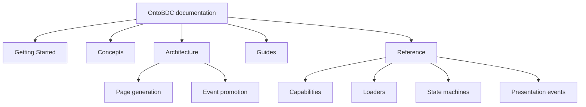

# OntoBDC Documentation

This documentation describes OntoBDC from user, architecture, specification, runtime, and development perspectives.

## Getting Started

- [What is OntoBDC?](../01-getting-started/what-is-ontobdc.md)
- [Installation](../01-getting-started/installation.md)
- [Quickstart](../01-getting-started/quickstart.md)
- [First Container](../01-getting-started/first-container.md)
- [CLI Basics](../01-getting-started/cli-basics.md)

## Concepts

- [Container](../02-concepts/container.md)
- [Presentation events](../02-concepts/presentation-events.md)
- [State machines](../02-concepts/state-machines.md)

## Architecture

- [Architecture overview](../03-architecture/index.md)
- [Page generation architecture](../03-architecture/page-generation.md)
- [Event promotion architecture](../03-architecture/event-promotion.md)

## Guides

- [Guides overview](../04-guides/index.md)
- [Testing `ontobdc-view`](../04-guides/testing-ontobdc-view.md)

## Reference

- [Commands](../05-reference/01-commands/index.md)
- [Capabilities](../05-reference/02-capabilities/index.md)
- [Loaders](../05-reference/03-loader/index.md)
- [State machines](../05-reference/04-state-machines/index.md)
- [Presentation events](../05-reference/06-events/index.md)

The technical reference follows executable source behavior. Metadata and state descriptions document intent, but when a current implementation is a stub or its artifact-level check is incomplete, the reference records that distinction explicitly rather than presenting the intended future behavior as already implemented.
