# dDock PresentationLayer e modelo de escopo de eventos

**Data:** 8 de agosto de 2026  
**Repositório:** `EliasMPJunior/ontobdc-doc`  
**Status:** manual de implementação arquitetural em evolução  
**Escopo:** relação entre `dDock`, `PresentationLayer`, os três níveis de evento e a primeira implementação Browser com contrato mínimo entre `Presentation Surface` e `Tile`

---

# 1. Definição central

A `dDock` é a infraestrutura responsável por **receber, armazenar e entregar eventos**.

Ela não interpreta o domínio dos eventos. Sua função é infraestrutural: persistência, disponibilidade, despacho, replay, retenção e demais mecanismos de store-and-forward definidos pelo runtime.

## Invariante

> **Toda dDock possui uma PresentationLayer.**

A `PresentationLayer` é o mecanismo pelo qual a dDock pode **materializar, manifestar ou tornar perceptível** informação, estado, intenção ou evento.

`Presentation` não significa necessariamente interface gráfica.

Uma PresentationLayer pode ser:

- um LED;
- um display monocromático;
- uma tela colorida;
- um terminal;
- um arquivo de log;
- um alto-falante;
- uma voz sintética;
- um atuador;
- um painel automotivo;
- um relógio;
- um equipamento industrial;
- um dinossauro falante;
- qualquer outro meio capaz de manifestar informação ou reação perceptível.

A consequência é importante:

> **A PresentationLayer é definida por sua função arquitetural, não pela tecnologia visual usada.**

---

# 2. Relação geral entre dDock e PresentationLayer

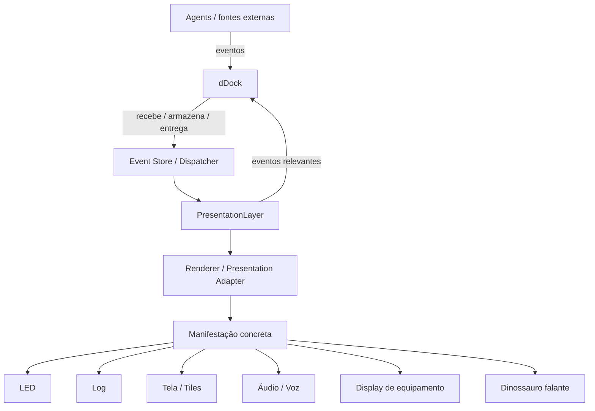

A PresentationLayer é uma camada da dDock, mas **não substitui a dDock**.

A dDock continua sendo a infraestrutura de eventos. A PresentationLayer é o domínio especializado de apresentação desses eventos e das interações geradas durante a apresentação.

---

# 3. Os três níveis de evento da PresentationLayer

A PresentationLayer trabalha com **três escopos de evento**:

1. `Component Event` — evento local de um componente ou implementação concreta;
2. `Presentation Global Event` — evento global dentro daquela PresentationLayer;
3. `External Event` — evento que cruza a fronteira da PresentationLayer e entra ou sai da dDock.

Esses níveis não representam três tecnologias obrigatórias. Representam **três escopos arquiteturais**.

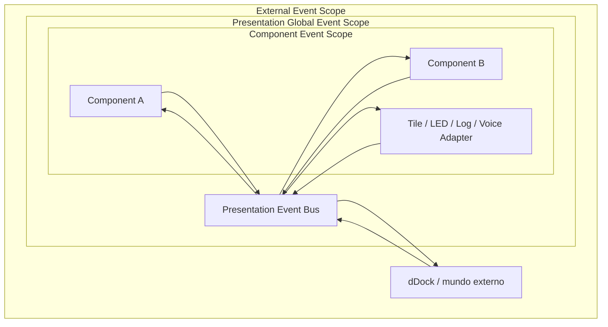

---

# 4. Nível 1 — Component Event

## Definição

`Component Event` é um evento cuja origem e significado imediato pertencem à **implementação concreta de um componente de apresentação**.

Ele normalmente nasce de uma interação física, mudança interna, callback ou mecanismo próprio da tecnologia usada.

Exemplos em uma tela HTML:

- `click`;
- `pointerdown`;
- `focus`;
- `blur`;
- `input`;
- `change`;
- `mouseenter`;
- fim de animação;
- resize interno.

Exemplos fora do HTML:

- botão físico pressionado;
- LED terminou um ciclo de sinalização;
- encoder foi girado;
- sintetizador de voz terminou uma frase;
- controle remoto recebeu uma tecla;
- display recebeu toque;
- o dinossauro terminou de falar.

## Escopo

O evento pertence ao componente ou ao renderer concreto.

Ele **não precisa sair desse nível**.

Um evento local só é promovido para outro escopo quando existe significado arquitetural além do próprio componente.

Exemplo:

- `pointermove` normalmente morre no componente;
- `click` pode ser convertido em `ActionInvoked`;
- fim de uma animação pode permanecer puramente local;
- seleção de uma entidade pode ser convertida em `EntitySelected`.

## Regra

> **Evento físico/local não é automaticamente evento semântico.**

---

# 5. Nível 2 — Presentation Global Event

## Definição

`Presentation Global Event` é um evento cujo escopo é **toda aquela instância da PresentationLayer**.

É chamado de “global” apenas dentro desse limite.

> **Global da PresentationLayer não significa global da dDock, da rede ou do sistema inteiro.**

Esse nível permite que componentes, Tiles, renderers e outros participantes da apresentação reajam uns aos outros **sem acoplamento direto**.

Exemplos:

- `ActionInvoked`;
- `TileSelected`;
- `TileActivated`;
- `EntitySelected`;
- `ContextActivated`;
- `PresentationRequested`;
- `PresentationChanged`;
- `TilePinned`;
- `TileResized`;
- `SurfaceChanged`;
- `NavigationIntent`;
- `ShowDetailsRequested`.

## Responsabilidade

A PresentationLayer deve possuir um mecanismo de distribuição para esses eventos, conceitualmente um `Presentation Event Bus`.

A tecnologia concreta depende do renderer/runtime.

Num browser, uma implementação natural pode usar `EventTarget` + `CustomEvent`.

Em outro runtime, pode haver outro mecanismo equivalente.

## Regra

> **Componentes não precisam conhecer outros componentes. Eles conhecem o contrato de eventos globais da PresentationLayer.**

---

# 6. Nível 3 — External Event

## Definição

`External Event` é um evento que **cruza a fronteira da PresentationLayer**.

Ele pode seguir em qualquer uma das duas direções:

- **entrada:** dDock → PresentationLayer;
- **saída:** PresentationLayer → dDock.

O External Event entra no universo de eventos que a dDock pode receber, armazenar, entregar, retransmitir ou persistir conforme sua política.

Exemplos de entrada:

- `TaskAssigned`;
- `EmergencyActivated`;
- `PersonDetected`;
- `MeasurementChanged`;
- `MeetingStarting`;
- `ContextRequested`;
- `ShowSchedule`;
- evento vindo de BLE;
- evento vindo de outro Agent;
- evento recuperado por replay;
- evento recebido de outra dDock.

Exemplos de saída:

- `TaskApproved`;
- `EntitySelected`, quando a seleção possui significado além da UI;
- `ContextChanged`, quando interessa a outros Agents;
- `CommandRequested`;
- `AcknowledgementRequested`;
- uma intenção gerada por interação do usuário.

## Regra

> **Só deve virar External Event aquilo que possui significado fora da PresentationLayer.**

Eventos efêmeros de interação não devem poluir a dDock.

---

# 7. Promoção e redução de escopo

Os três níveis não formam uma fila obrigatória pela qual todo evento deve passar.

Um evento pode morrer no nível onde nasceu.

A passagem de um nível para outro é uma **transformação deliberada de escopo e significado**.

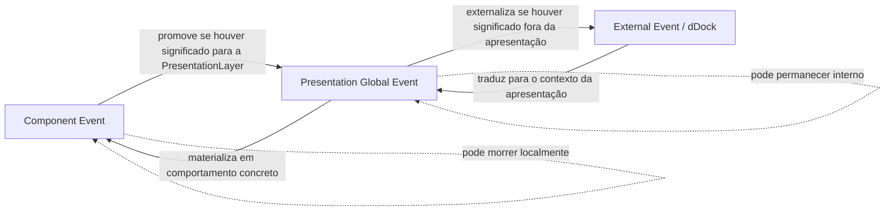

Exemplo de saída:

```text
click
  ↓
ActionInvoked(action="approve-task")
  ↓
TaskApprovalRequested(task=123)
  ↓
dDock
```

Nesse caso:

- `click` é Component Event;
- `ActionInvoked` é Presentation Global Event;
- `TaskApprovalRequested` é External Event.

O inverso também ocorre.

Exemplo de entrada:

```text
EmergencyActivated
  ↓
dDock entrega à PresentationLayer
  ↓
PresentationAlertRequested
  ↓
LED pisca / Tile aparece / voz fala / log registra
```

---

# 8. Fluxo de saída — interação para a dDock

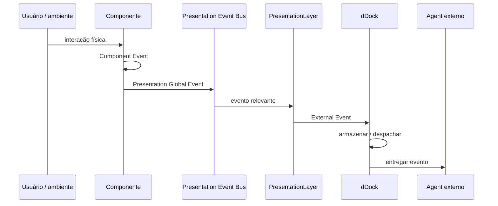

Nem todos os passos são obrigatórios.

Se a interação não tiver significado além do componente, o fluxo pode terminar no primeiro nível.

Se tiver significado apenas dentro da apresentação, termina no segundo.

---

# 9. Fluxo de entrada — dDock para apresentação

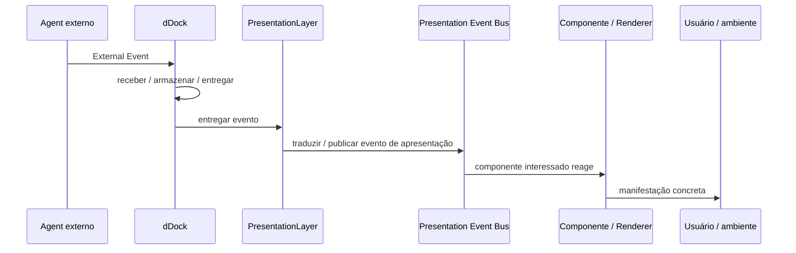

A manifestação final pode ser uma tela, um LED, um texto de log, som, voz ou qualquer outro mecanismo suportado pelo runtime.

---

# 10. PresentationLayer sem tela

A existência da PresentationLayer **não implica a existência de uma Presentation Surface visual**.

Uma dDock muito simples pode ter:

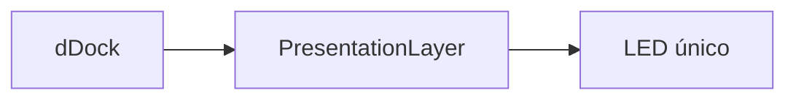

Outra pode ter:

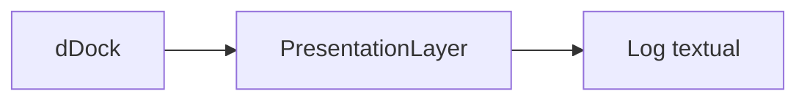

Outra pode ter:

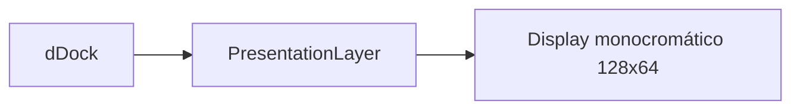

E uma dDock rica pode ter:

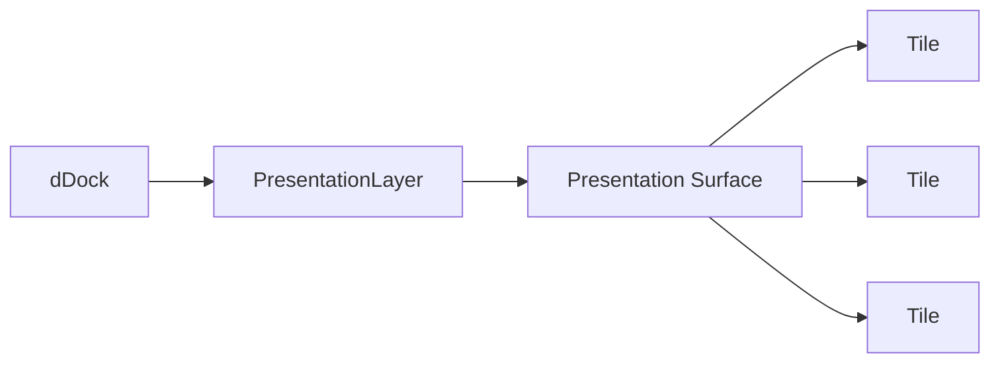

A `Presentation Surface` e os `Tiles`, portanto, são **uma forma possível de implementação da PresentationLayer**, não a definição da PresentationLayer inteira.

---

# 11. Exemplo: dDock com display monocromático barato

Uma dockstation física pode possuir um display extremamente simples.

O hardware pode declarar capacidades como:

- resolução;
- monocromático ou colorido;
- presença ou ausência de touch;
- número de linhas;
- taxa de atualização;
- capacidades de áudio;
- outros recursos de apresentação.

A PresentationLayer usa essas capabilities para decidir como materializar a informação.

Exemplo:

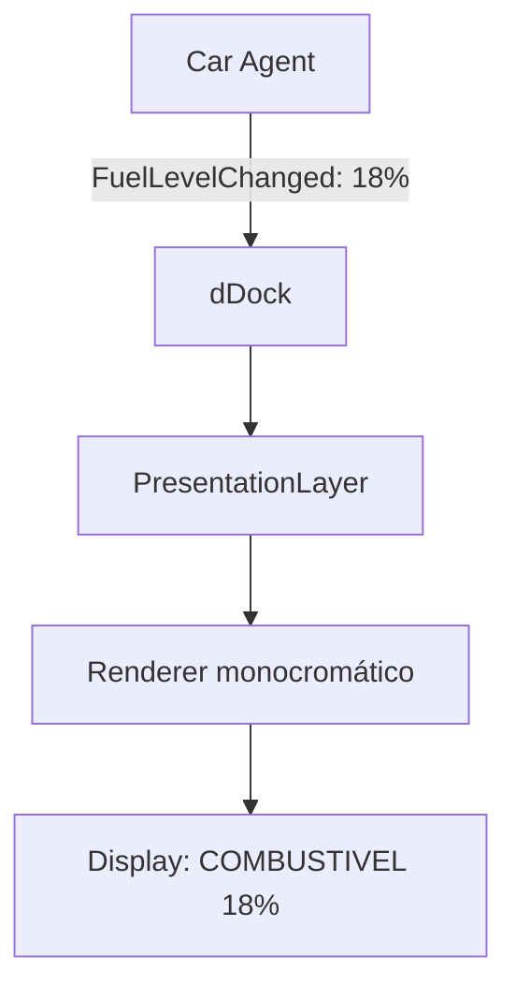

A dDock não precisa saber o significado de combustível.

O Agent conhece o domínio. A dDock conhece eventos. A PresentationLayer conhece apresentação. O renderer conhece aquele hardware.

---

# 12. Exemplo: mesma dDock, apresentações diferentes

O mesmo External Event pode gerar manifestações completamente diferentes conforme as capabilities disponíveis.

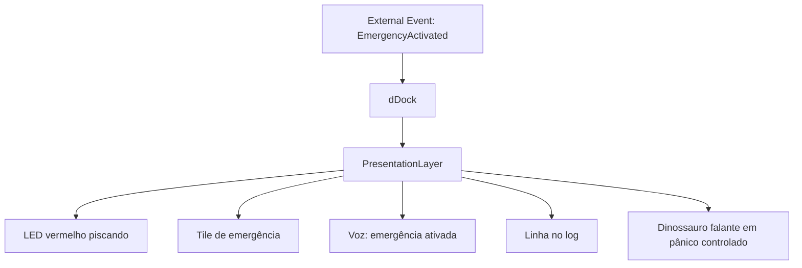

O evento permanece semanticamente o mesmo.

A materialização muda.

---

# 13. Responsabilidades

## dDock

Responsável por:

- receber eventos;
- armazenar eventos;
- entregar eventos;
- replay quando aplicável;
- retenção/TTL quando aplicável;
- despacho;
- identidade técnica de origem/destino;
- mecanismos infraestruturais de transporte/persistência.

Não deve possuir inteligência de domínio.

## PresentationLayer

Responsável por:

- receber eventos externos destinados à apresentação;
- converter eventos externos em eventos globais de apresentação quando necessário;
- distribuir eventos globais;
- materializar eventos por meio de renderers/componentes;
- converter interações locais em eventos de apresentação;
- externalizar para a dDock somente eventos que tenham significado fora da camada de apresentação.

## Component / Renderer

Responsável por:

- interação concreta;
- manifestação concreta;
- eventos locais;
- tradução entre primitive física/tecnológica e contrato de apresentação.

## Agent

Responsável por:

- compreender o domínio;
- produzir fatos e intenções semanticamente significativos;
- consumir eventos de domínio;
- agir sobre o domínio quando autorizado.

---

# 14. Regra de ouro dos três níveis

A arquitetura deve evitar dois extremos:

- **subir tudo**, transformando a dDock em um esgoto de eventos de UI;
- **reter tudo localmente**, impedindo que interações importantes se tornem fatos ou intenções utilizáveis por outros Agents.

A regra é:

> **O evento sobe de escopo somente quando seu significado sobe de escopo.**

Em forma compacta:

```text
Component Event
    "aconteceu comigo"

Presentation Global Event
    "aconteceu nesta PresentationLayer"

External Event
    "isso importa além desta PresentationLayer"
```

---

# 15. Arquitetura consolidada neste ponto

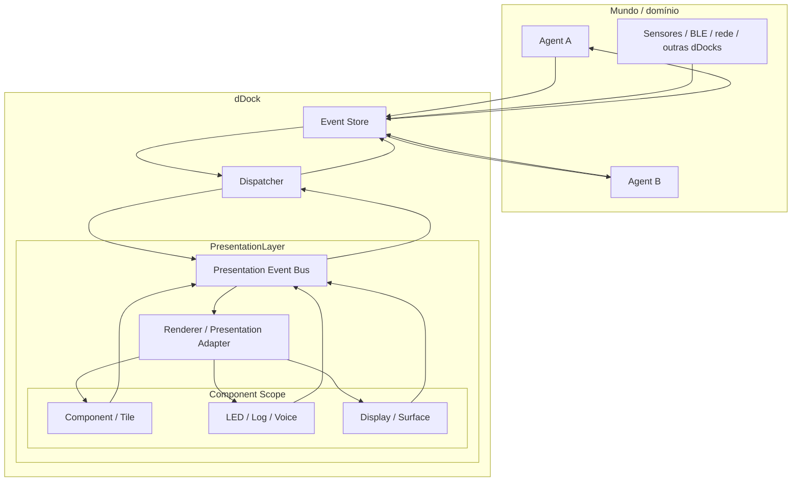

A separação conceitual fica:

> **Agent = domínio**  
> **dDock = receber, armazenar e entregar eventos**  
> **PresentationLayer = manifestação e interação**  
> **Component Event = escopo local**  
> **Presentation Global Event = escopo da apresentação**  
> **External Event = escopo além da apresentação**

---

# 16. Decisões assumidas neste documento

1. Toda `dDock` possui uma `PresentationLayer`.
2. `PresentationLayer` não significa necessariamente tela ou UI gráfica.
3. A PresentationLayer pode variar de um LED a uma superfície visual complexa.
4. A PresentationLayer reconhece três escopos de evento: componente, global da apresentação e externo.
5. Nem todo evento de componente vira evento global.
6. Nem todo evento global vira evento externo.
7. A passagem entre níveis é uma mudança deliberada de escopo e significado.
8. Eventos externos entram e saem pela fronteira entre PresentationLayer e dDock.
9. A dDock permanece sem inteligência de domínio.
10. Agents permanecem responsáveis pela semântica do domínio.
11. `Presentation Surface` e `Tile` são implementações possíveis dentro da PresentationLayer, não pré-requisitos para que uma PresentationLayer exista.
12. O mesmo evento semântico pode ser manifestado por tecnologias radicalmente diferentes sem alterar seu significado.

---

# 17. Questões ainda abertas

Este documento fixa o **modelo de escopo**, mas não congela ainda:

- nomes definitivos das classes/eventos;
- envelope final de eventos;
- regras formais de promoção entre escopos;
- quais eventos globais são persistíveis;
- como capabilities da PresentationLayer serão declaradas;
- como múltiplas PresentationLayers coexistem em uma mesma dDock, caso isso seja permitido no futuro;
- regras de segurança/autorização para externalização de eventos;
- lifecycle de renderers e componentes;
- versionamento dos contratos de apresentação.

Esses pontos devem ser definidos posteriormente sem quebrar a separação de responsabilidades estabelecida aqui.

---

# 18. Primeiro alvo de implementação: navegador offline

A primeira implementação concreta da PresentationLayer será feita no **navegador**, mas essa escolha não deve contaminar o contrato arquitetural universal.

O artefato alvo não é um site tradicional.

A premissa de implementação é:

> **o terminal gera um HTML executável e offline, que é aberto localmente pelo navegador e carrega consigo o runtime necessário.**

Não devem ser pressupostos para o funcionamento básico:

- servidor Web;
- backend ativo;
- API remota;
- CDN;
- conexão com Internet;
- framework JavaScript específico;
- roteamento HTTP de aplicação.

O browser pode ser usado intensamente como tecnologia de implementação da PresentationLayer, inclusive com:

- DOM;
- Custom Elements;
- Shadow DOM;
- CSS Grid;
- CSS;
- `EventTarget`;
- `CustomEvent`;
- IndexedDB;
- Web Workers / Service Workers quando necessários;
- APIs de geometria e layout do próprio browser.

Mas tudo isso deve permanecer **abaixo da fronteira arquitetural da implementação Browser**.

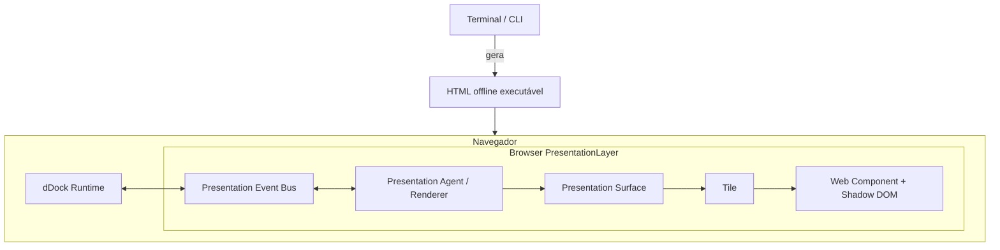

## Regra de implementação

> **Pode-se usar livremente tecnologia específica do browser, desde que ela não seja promovida sem necessidade para o contrato universal da PresentationLayer.**

---

# 19. Talking Dinosaur Test

O **Talking Dinosaur Test** passa a ser uma regra informal de revisão arquitetural.

Ele existe para impedir que decisões tomadas para a primeira implementação Browser sejam confundidas com leis universais da PresentationLayer.

A pergunta é:

> **“O dinossauro falante consegue interpretar isso de alguma forma coerente?”**

Se uma propriedade só possui significado porque existe DOM, CSS, mouse, viewport ou pixels, ela provavelmente pertence à implementação Browser.

Se a propriedade expressa uma intenção ou capacidade de apresentação que também pode ser reinterpretada por outro meio, ela pode pertencer a uma abstração mais geral.

Exemplos:

- `grid-column: span 4` → Browser-specific;
- `pointerenter` → Component Event específico do browser;
- `EmergencyActivated` → semântico e independente da apresentação;
- `language = pt-BR` → pode ser usado por tela, voz ou dinossauro;
- `importance = critical` → pode virar cor, som, volume, animação, prioridade ou comportamento equivalente;
- `availableArea` → no browser pode ser espaço bidimensional; no dinossauro pode limitar quanto ele pode falar;
- `theme = dark` → no browser pode alterar fundo e contraste; numa representação falada pode ser reinterpretado como tom mais baixo, menor intensidade, sussurro ou outra convenção do renderer.

O teste não exige que todas as PresentationLayers produzam a mesma manifestação física.

Ele exige apenas que **o contrato não seja definido desnecessariamente em termos de uma única tecnologia**.

---

# 20. Fronteira mínima entre Presentation Surface e Tile

Para a primeira implementação Browser, a fronteira entre `Presentation Surface` e `Tile` deve permanecer pequena.

A Surface oferece ao Tile um **pedido de apresentação**.

Esse pedido é dividido em três blocos:

```text
TilePresentationRequest
├── required
├── optional
└── extra
```

A classificação não pertence definitivamente à propriedade.

Ela pertence **àquela solicitação concreta da Surface**.

Uma propriedade pode ser `required` em uma situação e `optional` em outra.

Exemplo: `transparentBackground` não é, por natureza, obrigatório nem opcional. É a Surface que determina a força daquela exigência.

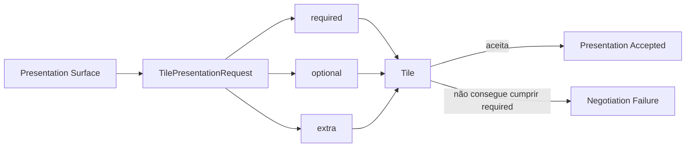

---

# 21. `required`

`required` contém requisitos que **devem ser atendidos** para que aquela materialização seja considerada válida.

Exemplo:

```yaml
required:
  language: pt-BR
  availableArea:
    columns: 4
    rows: 2
  theme: dark
  transparentBackground: true
```

Se o Tile não suporta qualquer requisito obrigatório, ele deve **rejeitar a solicitação**.

Exemplo conceitual de falha:

```yaml
status: rejected
reason: unsupported_requirement
requirement: transparentBackground
requestedValue: true
```

A Presentation Surface recebe essa resposta e decide o fallback.

Ela pode, por exemplo:

- oferecer outra área;
- selecionar outra representação;
- selecionar outro Tile;
- relaxar uma exigência, se a própria regra permitir;
- não materializar o Tile;
- apresentar um erro ou estado alternativo.

## Exception versus resultado de negociação

A implementação JavaScript pode eventualmente usar uma exception internamente, mas o contrato semântico não deve depender disso.

O conceito arquitetural é:

> **um requisito obrigatório não atendido produz uma falha explícita de negociação de apresentação.**

---

# 22. `optional`

`optional` contém preferências da Surface que devem ser tratadas em regime **best effort**.

Exemplo:

```yaml
optional:
  transparentBackground: true
  font:
    family: Inter
  colors:
    accent: "#38bdf8"
```

O Tile pode:

- atender completamente;
- atender parcialmente;
- ignorar;
- mapear para uma alternativa equivalente.

A falha em atender um item `optional` **não invalida a apresentação**.

Uma propriedade desconhecida em `optional` deve poder ser ignorada.

---

# 23. `extra`

`extra` contém contexto adicional disponibilizado pela Surface ou pelo ambiente.

Não é, por definição, uma exigência de apresentação.

Exemplos:

```yaml
extra:
  timezone: America/Sao_Paulo
  geolocation:
    latitude: -22.9
    longitude: -43.2
  localeContext:
    measurementSystem: metric
  ambientLight: low
  deviceOrientation: portrait
```

Outros dados poderão aparecer no futuro, incluindo contexto de usuário e permissões, quando esses contratos forem definidos.

O Tile pode usar qualquer informação presente em `extra` ou ignorá-la completamente.

## Regra de compatibilidade

> **Uma chave desconhecida em `extra` nunca deve invalidar a apresentação.**

Isso permite evolução do protocolo sem exigir que Tiles antigos conheçam todos os contextos futuros.

---

# 24. Semântica dos três blocos

A intenção de cada bloco pode ser lida assim:

```text
required
    "isto precisa ser atendido"

optional
    "eu prefiro isto, se você conseguir"

extra
    "estou te contando isto; use se for útil"
```

A diferença entre `optional` e `extra` é importante.

`optional` ainda representa **uma preferência de apresentação** da Surface.

`extra` representa **contexto disponível**, sem pedido de conformidade.

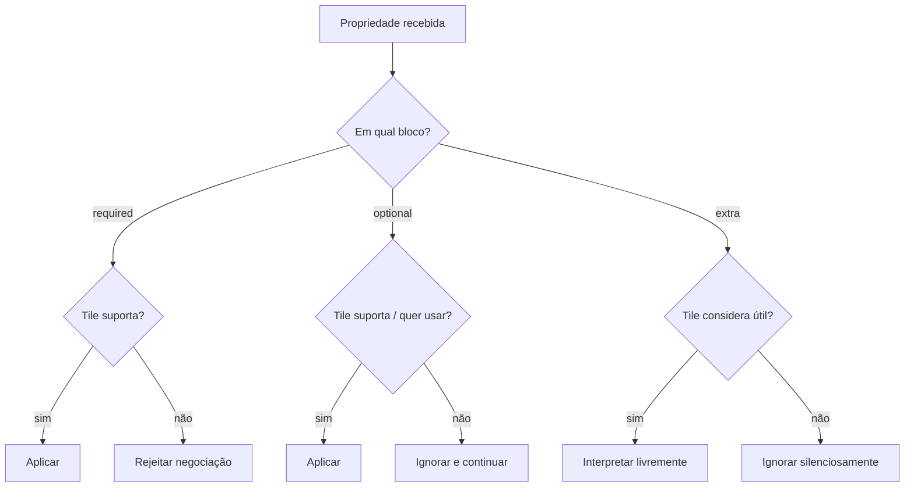

---

# 25. Capacidade espacial do Tile no Browser

Na implementação Browser, a Presentation Surface trabalha com uma grade lógica.

O Tile deve poder declarar limites independentes para coluna e linha.

A capability espacial mínima prevista é:

```text
minColumns
minRows
maxColumns
maxRows
```

Opcionalmente, o Tile também pode declarar uma região preferencial:

```text
preferredColumns
preferredRows
```

Exemplo:

```yaml
spatialCapabilities:
  minColumns: 2
  minRows: 1
  maxColumns: 8
  maxRows: 6
  preferredColumns: 4
  preferredRows: 2
```

Essa separação é necessária porque duas regiões com a mesma área matemática podem ser apresentações completamente diferentes.

`2 × 4` e `4 × 2` não são equivalentes do ponto de vista do Tile.

## Área oferecida

Durante a materialização, a Surface informa a área efetivamente disponível para aquele Tile:

```yaml
availableArea:
  columns: 4
  rows: 2
```

O Tile escolhe a representação compatível com essa alocação.

## Regra

> **O contrato espacial Browser deve trabalhar primeiro com unidades lógicas de grid, não com pixels físicos como identidade universal do Tile.**

O componente concreto pode conhecer sua geometria final em CSS pixels para executar layout interno, mas essa é uma responsabilidade local da implementação Browser.

---

# 26. Relação entre capabilities do Tile e pedido da Surface

A negociação espacial possui dois lados distintos:

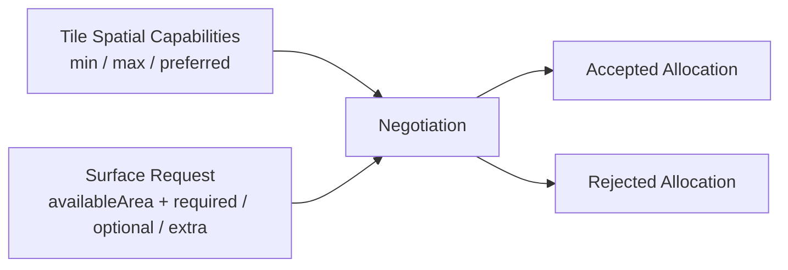

O Tile diz, em essência:

> “Estes são os limites dentro dos quais consigo me apresentar.”

A Surface diz:

> “Neste instante eu tenho esta área e estas exigências/preferências/contextos.”

A materialização só ocorre quando os requisitos obrigatórios são compatíveis.

---

# 27. Parâmetros inicialmente previstos para o Tile Browser

O conjunto inicial discutido inclui:

- `language`;
- `availableArea`;
- `theme`;
- `transparentBackground`;
- `font`;
- `colors`;
- `extra` para contexto arbitrário;
- futuramente identidade do usuário e permissões.

Além disso, o Tile declara capabilities espaciais:

- `minColumns`;
- `minRows`;
- `maxColumns`;
- `maxRows`;
- `preferredColumns` opcional;
- `preferredRows` opcional.

Esses parâmetros **não possuem todos uma força fixa**.

Por exemplo:

```yaml
required:
  language: pt-BR
  availableArea:
    columns: 4
    rows: 2

optional:
  theme: dark
  transparentBackground: true
  font:
    family: Inter

extra:
  timezone: America/Sao_Paulo
```

Em outra Surface, `theme: dark` e `transparentBackground: true` podem estar em `required`.

A classificação expressa a exigência da Surface naquela materialização.

---

# 28. `PresentationCapacity` como abstração acima da geometria Browser

Para a implementação imediata, o Browser usará `columns × rows`.

Entretanto, a arquitetura não deve assumir que toda PresentationLayer possui uma geometria cartesiana bidimensional.

O conceito mais geral pode ser tratado futuramente como `PresentationCapacity`.

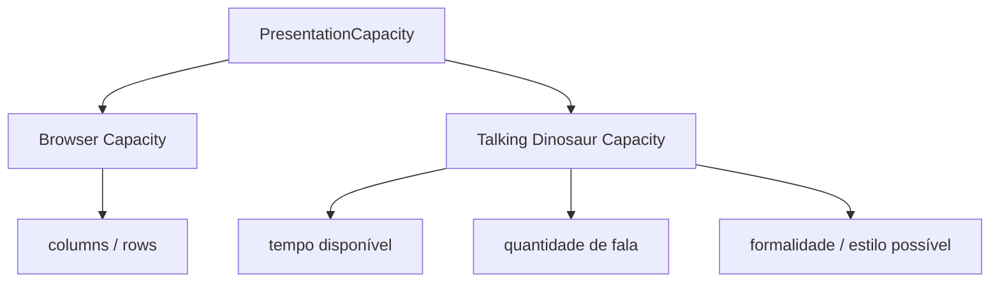

O objetivo dessa abstração não é implementar agora um renderer de dinossauro.

O objetivo é impedir que `columns` e `rows` sejam tratados como propriedades universais da PresentationLayer.

No browser, `availableArea` é espacial.

No dinossauro falante, o equivalente conceitual pode significar quanto tempo existe para falar, quanto conteúdo cabe e quais dimensões expressivas estão disponíveis.

---

# 29. Theme também é semântico antes de ser CSS

`theme` não deve ser reduzido automaticamente a “cor de fundo da página”.

Na implementação Browser:

- `light` pode significar fundo claro e conteúdo escuro;
- `dark` pode significar fundo escuro e conteúdo claro;
- outros profiles podem afetar contraste, bordas, sombras e tokens visuais.

Em outra PresentationLayer, o mesmo papel pode ser reinterpretado.

No Talking Dinosaur Test, por exemplo, um profile `dark` poderia resultar em:

- voz mais baixa;
- ritmo diferente;
- sussurro;
- menor intensidade sonora;
- outra convenção definida pelo renderer.

Isso não significa que essas regras devam existir no protocolo universal.

Significa apenas:

> **o valor semântico não deve carregar prematuramente a implementação CSS dentro dele.**

---

# 30. Exemplo completo de negociação

## Pedido

```yaml
presentationRequest:
  required:
    language: pt-BR
    availableArea:
      columns: 4
      rows: 2
    transparentBackground: true

  optional:
    theme: dark
    font:
      family: Inter
    colors:
      accent: "#38bdf8"

  extra:
    timezone: America/Sao_Paulo
    geolocation:
      latitude: -22.9
      longitude: -43.2
```

## Capability do Tile

```yaml
spatialCapabilities:
  minColumns: 1
  minRows: 1
  maxColumns: 8
  maxRows: 6
  preferredColumns: 4
  preferredRows: 2

presentationCapabilities:
  transparentBackground: true
  themes:
    - light
    - dark
  fontOverride: false
  colorOverride: true
```

## Resultado possível

```yaml
status: accepted
allocation:
  columns: 4
  rows: 2
applied:
  - language
  - availableArea
  - transparentBackground
  - theme
  - colors
ignoredOptional:
  - font
usedExtra:
  - timezone
```

## Resultado de incompatibilidade

Se o mesmo Tile não suportasse fundo transparente:

```yaml
status: rejected
reason: unsupported_requirement
requirement: transparentBackground
requestedValue: true
```

A Surface então decide o próximo passo.

---

# 31. Regras do contrato Surface ↔ Tile

1. A Surface envia um pedido dividido em `required`, `optional` e `extra`.
2. A mesma propriedade pode ocupar blocos diferentes em solicitações diferentes.
3. Todo item de `required` precisa ser atendido.
4. Item obrigatório desconhecido ou não suportado deve produzir rejeição explícita da negociação.
5. Falha em `optional` não invalida a apresentação.
6. Item `optional` desconhecido pode ser ignorado.
7. `extra` é contexto, não requisito.
8. Chave desconhecida em `extra` nunca invalida a apresentação.
9. O Tile pode usar `extra` livremente quando reconhecer valor naquele contexto.
10. A Surface é responsável pela decisão de fallback após uma rejeição.
11. O Tile declara seus limites espaciais mínimos e máximos no Browser.
12. Preferências espaciais podem ser declaradas separadamente dos limites.
13. Área deve preservar dimensões independentes; `columns × rows`, não apenas área escalar.
14. Pixels concretos pertencem ao renderer/componente Browser, não ao contrato universal.
15. O Browser é a primeira implementação, não a definição ontológica da PresentationLayer.
16. Toda adição ao contrato deve ser submetida ao Talking Dinosaur Test antes de ser promovida a conceito universal.

---

# 32. Arquitetura Browser neste ponto

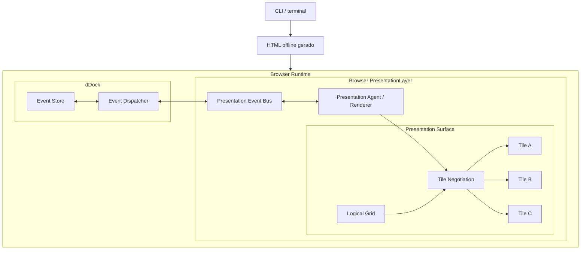

O recorte atual de implementação é deliberadamente restrito:

> **HTML offline gerado pelo CLI → Browser PresentationLayer → Presentation Surface → Tiles → Components encapsulados.**

Outras PresentationLayers continuam relevantes apenas como teste arquitetural para impedir engessamento prematuro.

---

# 33. Questões abertas após esta definição

Ainda não estão congelados:

- schema formal do `TilePresentationRequest`;
- nome definitivo de `PresentationCapacity`;
- protocolo de descoberta das capabilities do Tile;
- se a descoberta é síncrona, declarativa ou orientada a eventos;
- forma de resposta da negociação;
- taxonomia definitiva de themes;
- representação de cores e fontes;
- como locale se relacionará com `language`;
- contrato de identidade de usuário;
- contrato de autorização/permissões;
- tratamento de geolocalização sensível;
- persistência ou não dos pedidos/resultados de apresentação;
- lifecycle do Tile;
- política de fallback da Surface;
- relação entre negociação espacial e recência/prioridade dos Tiles;
- se `preferredColumns` / `preferredRows` são suficientes ou se Tiles poderão oferecer múltiplos perfis espaciais discretos.

Esses itens podem evoluir sem alterar as decisões já assumidas sobre escopo de eventos, separação da dDock e os três níveis `required` / `optional` / `extra` da negociação Surface ↔ Tile.

---

# 34. Presentation System Log

A barra compacta inicialmente criada para depuração da `Presentation Surface` passa a ser mantida como parte da implementação Browser da `PresentationLayer`, com o papel de **Presentation System Log**.

Ela não é apenas um console técnico. É uma manifestação visual curta do estado operacional recente da camada de apresentação.

## Regra inicial

> **O System Log mostra o último evento ou estado operacional relevante da PresentationLayer em uma única linha curta e legível.**

Na implementação Browser, exemplos de mensagens incluem:

```text
Tema light
Surface 4 col · slot 73px
Tile "Configurações" acionado
Contexto "obra" restaurado
Tile recusou required.transparentBackground
Fallback aplicado: representação compacta
```

O System Log pode refletir eventos de qualquer um dos três escopos quando forem relevantes para a compreensão operacional da apresentação, mas **não transforma automaticamente esses eventos em External Events**.

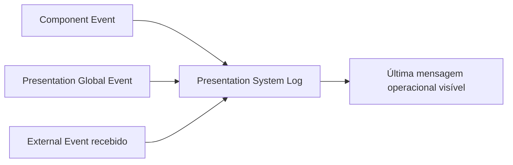

## Responsabilidade

O System Log pertence à `PresentationLayer`, não à dDock.

A dDock continua responsável por receber, armazenar e entregar eventos. O System Log apenas **materializa informação operacional relevante** da apresentação.

Ele pode mostrar, por exemplo:

- alteração de theme;
- cálculo atual da Surface;
- quantidade de colunas;
- tamanho lógico/final do slot no renderer Browser;
- Tile criado, apresentado ou acionado;
- falha de negociação;
- fallback aplicado;
- contexto ativado/restaurado;
- evento externo recebido e materializado;
- outras transições relevantes para a PresentationLayer.

## Comportamento inicial no Browser

A versão inicial deve permanecer deliberadamente simples:

- uma linha;
- mensagem curta;
- apresenta o último estado/evento relevante;
- não ocupa a área lógica dos Tiles;
- permanece discreta e legível;
- pode ser atualizada em tempo real conforme a PresentationLayer opera.

O comportamento atual do protótipo — por exemplo:

```text
Tema light · Surface 4 col · slot 73.0px · 4×2 + 2×2 + 1×1 + 1×1
```

é considerado uma primeira implementação válida do conceito.

## Evolução prevista

No futuro, o System Log poderá ter dois modos:

```text
compact
    última mensagem / último estado relevante

expanded
    histórico recente de eventos e estados da PresentationLayer
```

O modo expandido não está no escopo imediato, mas o design do modo compacto não deve impedir essa evolução.

## Talking Dinosaur Test

O conceito passa no Talking Dinosaur Test.

O renderer Browser materializa o log como uma linha visual compacta.

Outra PresentationLayer poderia materializar a mesma função de observabilidade de outra forma: uma fala curta, sinal sonoro, LED de estado ou outro mecanismo adequado.

Portanto, **a função de observabilidade operacional pode ser geral, enquanto o System Log visual em formato de barra é específico do Browser renderer**.
