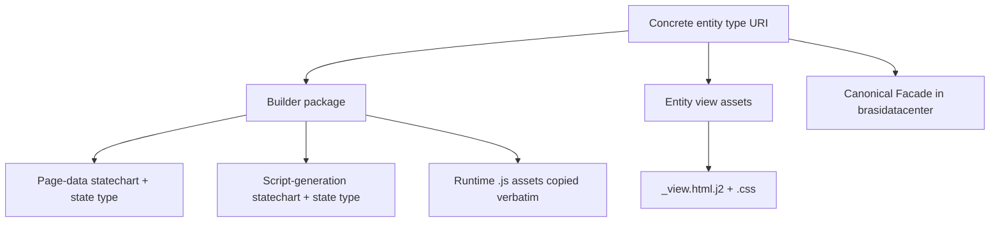

# Adding an Entity Page

This guide covers everything required to make a new concrete entity type produce a
standalone HTML Page during Surface generation. No registry is edited: the pipeline
discovers a new entity builder by package convention.

**Source of truth:** `EliasMPJunior/ontobdc-view@r008/v0.9`. Use
`page/plugin/builder/work_stream/` as the reference for a fully materialized, read-only
Entity Page; each entity still owns its state sequence and presentation model.

## What has to exist



| # | Path | Purpose |
| --- | --- | --- |
| 1 | `page/plugin/builder/<entity>/__init__.py` | Makes the builder a package the loaders can walk. |
| 2 | `page/plugin/builder/<entity>/<entity>.py` | `<Entity>PageDataProcessState`, its transition handler, and **`<Entity>PageGenerationDataTransitionHandler`** (the class the data loader resolves). |
| 3 | `page/plugin/builder/<entity>/<entity>_page_data.yaml` | The per-element Page-data statechart. |
| 4 | `page/plugin/builder/<entity>/<entity>_script_generation.py` | `<Entity>ScriptGenerationProcessState`, its handler, and `generate_<entity>_scripts(context)`. |
| 5 | `page/plugin/builder/<entity>/<entity>_script_generation.yaml` | The script-generation statechart. |
| 6 | `page/plugin/builder/<entity>/i18n_apply.js`, `xlsx-0.18.5.full.min.js`, … | Runtime scripts copied verbatim by the generic script capabilities. |
| 7 | `page/plugin/asset/entity/<entity>_view/<entity>_view.html.j2` | The entity-specific server-rendered template. |
| 8 | `page/plugin/asset/entity/<entity>_view/<entity>_view.css` | Entity-specific styles, concatenated after the shared `entity_page.css`. |

The shared header (`entity_page_header.html.j2`) and shared CSS (`entity_page.css`) already
exist under `page/plugin/asset/entity/common/` and are read by `EntityPageTemplateAdapter` for
every entity — do not copy them per entity.

## The class-name contract

`EntityDataGatheredCapability` calls `EntityPageGenerationDataTransitionHandlerLoader.get(entity_uri)`,
which derives **one exact expected class name** from the entity type URI:


Local-name extraction handles `#`, `/`, and `:` forms; non-alphanumeric separators become
PascalCase boundaries. If no class with that exact name subclasses the base handler in a
module under `ontobdc_view.page.plugin.builder`, the entity type is traversed but **no Page-data
is written** — silently, from the pipeline's point of view. A wrong suffix or casing is the
most common reason a new Page never appears.

See [Entity Page generation-data handler loader](../05-reference/03-loader/entity-page-generation-data-handler-loader.md).

## The two statecharts

Each builder owns its own state **type** and YAML. Reusable capabilities in
`page/plugin/capability/transformation/` provide common behavior, while an entity-specific
capability is appropriate when its data semantics are not generic. The per-entity handler
declares both the order and any explicit state-to-capability override.

- **Page-data** (`<entity>_page_data.yaml`): an entity-owned sequence that produces `payload` → `.__ontobdc__/view/<entity>/<identifier>.jsonld`. WorkStream currently adds dimension-card generation, its own relation/read-model capability, and ontology-backed toolbar gathering.
- **Script generation** (`<entity>_script_generation.yaml`): `vendor_sheet_js_asset_generated → i18n_script_generated → graph_reader_script_generated`. Output: `<script>.js` files copied into `.__ontobdc__/view/<entity>/`.

The transition handler normally resolves a state's capability through `CapabilityLoader` by the id
`org.ontobdc.view.plugin.capability.transformation.target.<state>`, but may explicitly map a state to an entity-qualified ID. It executes the capability with an
isolated context (`PageDataContextAdapter` / `PageScriptGenerationContextAdapter`) carrying
`builder_package = __package__` and `view_directory = <entity>`.

Statechart file location is resolved with:

```python
StatechartLocator.locate(
    __file__,
    "<entity>_page_data.yaml",
    statechart_package="ontobdc_view.page.plugin.builder.<entity>",
)
```

## Facade prerequisite

Page-data resolution reads the entity's Facade from
`<dataset>/.__ontobdc__/linkset/facade.ttl`, which is materialized from the canonical
`brasidatacenter/ontology/tool/<vendor>/entity/<entity>_facade.ttl` when an element of the
entity type is created. A new entity Page needs that canonical Facade to declare
`facade:hasDataEntityFacade` for the entity type and one `facade:hasFacadeField` per exposed
field. See [Facade](../02-concepts/facade.md).

## Verification

1. `ontobdc dev test` — add `test_<entity>_page_data.py`, template-publication coverage, and any entity-specific capability tests.
2. In a container that has an element of the new entity type: `ontobdc view --language pt-br`.
3. Confirm `<container>/.__ontobdc__/view/<entity>/<dcterms:identifier>.jsonld` exists with the complete render model and that its sibling `<dcterms:identifier>.html` already contains the expected entity data without a runtime folder connection.
