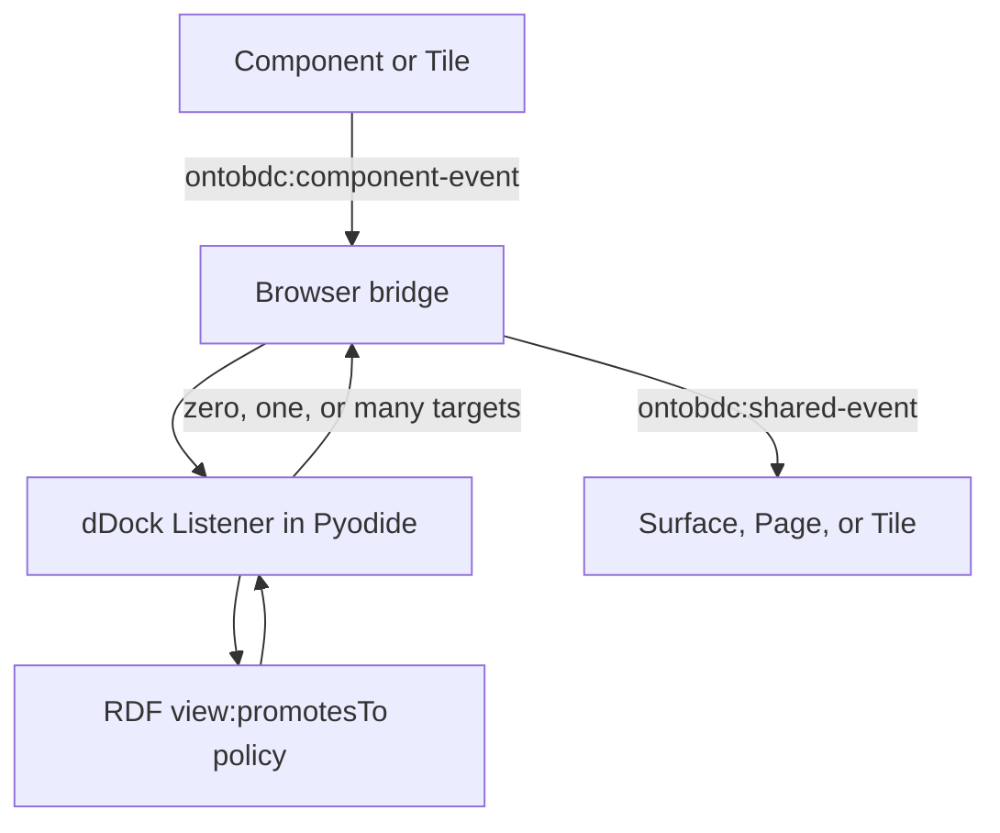
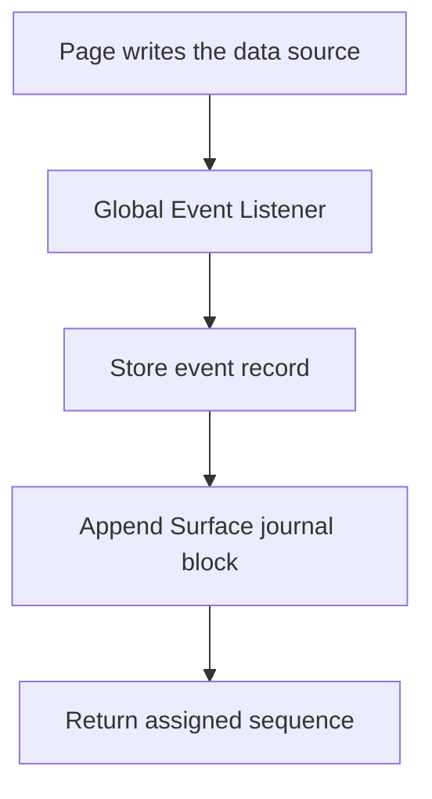

# Event promotion architecture

The Component Event to Shared Event flow spans four layers in three repositories. The split is intentional: Components detect semantic occurrences, RDF defines whether their scope increases, the dDock evaluates that policy, and the browser bridge transports the result.



## 1. Promotion policy: BrasidataCenter

The policy is data, not application code.

[`ontology/tool/ontobdc/abox/presentation_event.ttl`](https://github.com/Brasidata/brasidatacenter/blob/r008/v0.9/ontology/tool/ontobdc/abox/presentation_event.ttl) declares the `view:ComponentEvent` and `view:SharedEvent` individuals and their `view:promotesTo` relations. It is the only source of the decisions about which Component Event promotes to which Shared Event.

[`ontology/tool/ontobdc/tbox/view.ttl`](https://github.com/Brasidata/brasidatacenter/blob/r008/v0.9/ontology/tool/ontobdc/tbox/view.ttl) defines `view:PresentationEvent`, its event subclasses, and the `view:promotesTo` property. The property is not functional: one source may have several targets.

Neither Python nor JavaScript maintains a parallel promotion table.

## 2. Promotion engine: ontobdc-web-dock

[`ontobdc-web-dock`](https://github.com/EliasMPJunior/ontobdc-web-dock) is the Python dDock runtime embedded into the browser and executed by Pyodide.

| Responsibility | Main symbol | Implementation |
| --- | --- | --- |
| Browser-facing bootstrap and promotion call | `bootstrap()`, `promote()`, `is_ready()`, `WebDock` | `src/ontobdc_web_dock/bridge.py` |
| Parse and index the Turtle policy | `PromotionPolicy` | `dock/adapter/policy.py` |
| Execute the promotion state machine | `EventPromotionMachine` | `dock/adapter/machine.py` |
| Hold the bootstrapped policy and dispatch to a Listener | `PresentationEventDock` | `dock/adapter/listener.py` |
| Discover Listener plugins through `pkgutil` | `ListenerLoader` | `dock/adapter/loader.py` |
| Resolve Presentation Events and produce the answer | `PresentationEventPromotionListener` | `dock/plugin/listener/presentation_event.py` |
| Define the Listener contract | `ListenerPort`, `ListenerMetadata` | `dock/domain/port/listener.py` |
| Define promotion process states | `EventPromotionProcessState` | `dock/domain/machine/promotion_state.py` |

The runtime accepts the semantic event occurrence, resolves its IRI, checks that it is a Presentation Event, reads all RDF targets, and returns a promotion decision. No target is also a successful decision: it means the event remains at Component scope.

### Promotion statechart

The promotion engine makes its progress observable through the following states:

```text
EVENT_RECEIVED
    -> SEMANTIC_EVENT_RESOLVED
        -> PROMOTION_POLICY_EVALUATED
            -> PROMOTION_TARGETS_RESOLVED
                -> RESPONSE_PRODUCED
```

`SEMANTIC_EVENT_RESOLVED` is also the branch point. When the supplied name does not resolve to a declared `view:ComponentEvent`, the machine produces a response immediately, with no targets. A declared Component Event continues through policy evaluation even when the valid result is an empty target list.

## 3. Browser bridge and Surface packaging: ontobdc-view

[`component/adapter/dock.py`](https://github.com/EliasMPJunior/ontobdc-view/blob/r008/v0.9/src/ontobdc_view/component/adapter/dock.py) generates the bridge script. At Surface generation time it embeds:

- the Turtle promotion policy;
- the complete pure-Python `ontobdc_web_dock` source bundle;
- the JavaScript/Pyodide bootstrap and DOM transport.

The bridge listens once on `document` for `ontobdc:component-event`. The semantic name is read from `detail.event`; therefore the bridge does not need a list of event names.

If Pyodide is not ready, occurrences remain queued. A bootstrap failure is reported and the queue is preserved. There is deliberately no JavaScript fallback promotion map, because it would create a second source of truth.

For each RDF target returned by the Listener, the bridge dispatches one `ontobdc:shared-event`. The detail preserves the original semantic data and adds the target and source IRIs.

[`ontobdc_view.__init__.py`](https://github.com/EliasMPJunior/ontobdc-view/blob/r008/v0.9/src/ontobdc_view/__init__.py) exposes `component_event_promoter_source()` at the package boundary. [`SurfacePackagedCapability`](../05-reference/02-capabilities/surface/transformation/surface-packaged.md) calls that API and embeds the generated bridge as one of the inline `<script data-ontobdc-surface-component>` blocks in the offline Surface. The same bridge source can also be used by standalone generated Pages.

## 4. Producers and consumers: browser Components

Components and Tiles own the interpretation of their interactions. They translate native input into a semantic Component Event and emit the canonical envelope with `bubbles: true` and `composed: true`.

Consumers listen for the canonical Shared Event envelope and decide whether the semantic event is relevant to them. For example, `ComponentFileDoubleClick` promotes to `EntityPageRequested`; a compatible file Tile may consume that request without the File Tree knowing which representation will answer it.

This keeps dependencies pointed at the event contract rather than at another Component.

### Current browser inventory

The following inventory describes `ontobdc-view@r008/v0.9`. It is implementation evidence, not a registry: adding an event or consumer does not require editing a JavaScript master list.

Component Event producers currently include:

- `component/asset/onto-presentation-surface.js`;
- `component/plugin/tile/csv-file/onto-csv-file-tile.js`;
- `component/plugin/tile/file-size/onto-file-size-tile.js`;
- `component/plugin/tile/file-tree/onto-file-tree-tile.js`;
- `component/plugin/tile/file-viewer/onto-file-viewer-tile.js`;
- `component/plugin/tile/generic-file/onto-generic-file-tile.js`;
- `component/plugin/tile/image-file/onto-image-file-tile.js`;
- `component/plugin/tile/pdf-file/onto-pdf-file-tile.js`;
- `component/plugin/tile/photo/onto-photo-tile.js`;
- `component/plugin/tile/workstream/onto-workstream-tile.js`.

These producers report both user-interpreted occurrences and actual lifecycle state. For example, the Surface emits `SurfaceLoaded`; the File Tree emits `ComponentFileSingleClick` and `ComponentFileDoubleClick`; file representations emit Tile open, close, fullscreen, and restore events; and WorkStream emits `TileExpanded` and `TileCollapsed`.

Shared Event consumers currently include:

| Consumer | Event | Behavior |
| --- | --- | --- |
| CSV File Tile | `EntityPageRequested` | Reveals and moves the matching existing Tile when its path matches. |
| Generic File Tile | `EntityPageRequested` | Reveals and moves the matching existing Tile when its path matches. |
| Image File Tile | `EntityPageRequested` | Reveals and moves the matching existing Tile when its path matches. |
| PDF File Tile | `EntityPageRequested` | Reveals and moves the matching existing Tile when its path matches. |
| File Viewer Tile, document-level listener | `EntityPageRequested` with `kind = file` | Finds or creates the single Surface-wide viewer and opens the requested path. |
| File Viewer Tile, connected instance | `EntityPageDismissRequested` | Ends the presentation and closes the viewer Tile. |

The File Viewer is therefore not the only Shared Event consumer. It is the only current consumer that can create or locate the single generic viewer when that viewer is still closed and absent from the connected presentation tree.

## Promotion sequence

1. A Component interprets an interaction or runtime occurrence.
2. It dispatches `ontobdc:component-event` with the semantic name in `detail.event`.
3. The document-level bridge identifies the owning Surface and queues the occurrence.
4. The bridge bootstraps Pyodide and `ontobdc_web_dock` when necessary.
5. The Listener resolves the source against the embedded ontology.
6. The Listener reads every `view:promotesTo` target.
7. For each target, the bridge announces the promotion and dispatches `ontobdc:shared-event`.
8. With no target, processing ends normally and no Shared Event is emitted.

## Testing guidelines

Promotion is a cross-repository, cross-runtime contract. A test of one file or layer cannot be reported as proof that `ontobdc:component-event` becomes `ontobdc:shared-event` in the browser. Evidence must be identified by the boundary it actually exercises.

The test style follows the Surface transformation tests: use real Turtle and HTML fixtures, execute pure path joins, RDF parsing, indexing, state transitions, serialization, and DOM dispatch for real, and mock only genuine external boundaries. A test must not reproduce `view:promotesTo` as a Python or JavaScript mapping, because that would test a second policy rather than the shipped one.

### Current evidence status

| Repository | Promotion-test status |
| --- | --- |
| `Brasidata/brasidatacenter@r008/v0.9` | **Implemented and green.** 8 tests, [`tests/tool/test_presentation_event_ontology.py`](https://github.com/Brasidata/brasidatacenter/blob/r008/v0.9/tests/tool/test_presentation_event_ontology.py). |
| `EliasMPJunior/ontobdc-web-dock@master` | **Implemented and green.** 36 tests across [`tests/test_bridge.py`](https://github.com/EliasMPJunior/ontobdc-web-dock/blob/master/tests/test_bridge.py) and `tests/dock/`. |
| `EliasMPJunior/ontobdc-view@r008/v0.9` | **Implemented and green.** 24 tests across [`test/unit/component/adapter/test_dock.py`](https://github.com/EliasMPJunior/ontobdc-view/blob/r008/v0.9/test/unit/component/adapter/test_dock.py) (10) and [`test/unit/surface/plugin/capability/transformation/test_surface_packaged.py`](https://github.com/EliasMPJunior/ontobdc-view/blob/r008/v0.9/test/unit/surface/plugin/capability/transformation/test_surface_packaged.py) (14). |
| Browser end-to-end (layer 4) | **Not implemented.** No `test/view/test_event_promotion.py` exists yet; see that section below. |

Layers 1–3 prove the pieces described in each of their sections: real policy integrity, real semantic resolution and state traces, real bridge generation and Surface packaging. None of them proves that a browser actually loads Pyodide, resolves the policy, and dispatches `ontobdc:shared-event` -- only the layer-4 acceptance test proves that, and it has not been run.

### 1. BrasidataCenter: ontology policy tests

Suggested location:

```text
tests/tool/test_presentation_event_ontology.py
```

The test must load the real `view.ttl` TBox and `presentation_event.ttl` ABox distributed by the package and verify at least:

- every subject of `view:promotesTo` is explicitly declared a `view:ComponentEvent`;
- every promotion target is explicitly declared a `view:SharedEvent`;
- a zero-target Component Event remains valid, using `ComponentFileSingleClick` as the current case;
- a one-target relation is preserved, using `ComponentFileDoubleClick -> EntityPageRequested`;
- a multivalued relation returns every target, using `TileOpened -> TileReady, SurfaceAreaFilled`;
- all event subjects and targets are IRIs, not blank nodes or literals;
- the packaged ontology resource is the file under test, rather than a Turtle string copied into the test.

The ontology test proves policy integrity. It does not prove that Python resolves the policy or that the browser dispatches anything.

**Status: implemented, 8/8 passing.** [`tests/tool/test_presentation_event_ontology.py`](https://github.com/Brasidata/brasidatacenter/blob/r008/v0.9/tests/tool/test_presentation_event_ontology.py) loads the real packaged `view.ttl` and `presentation_event.ttl` (via `brasidatacenter.resources.ontology_path`, never a copied Turtle string) and covers every item above: `promotesTo` is a non-functional `owl:ObjectProperty` between `PresentationEvent`s, every subject/target is a declared `ComponentEvent`/`SharedEvent`, `ComponentFileSingleClick` has zero targets, `ComponentFileDoubleClick -> EntityPageRequested` is a one-target relation, `TileOpened -> TileReady, SurfaceAreaFilled` returns both targets, and every subject/target is a `URIRef`.

### 2. ontobdc-web-dock: semantic runtime tests

Tests should mirror the production tree:

```text
tests/
├── test_bridge.py
└── dock/
    ├── adapter/
    │   ├── test_policy.py
    │   ├── test_machine.py
    │   ├── test_listener.py
    │   └── test_loader.py
    └── plugin/listener/
        └── test_presentation_event.py
```

#### `PromotionPolicy`

Use a real Turtle fixture and verify:

- `from_turtle()` parses and indexes Component and Shared Events once;
- invalid Turtle raises `PromotionPolicyError` with a diagnostic message;
- local-name resolution works for the canonical event namespace and for fallback `#` and `/` IRIs;
- `promotion_targets()` returns zero, one, and every member of a multivalued relation;
- target ordering is deterministic;
- no SPARQL query or single-value `Graph.value()` behavior drops a target.

#### `EventPromotionMachine`

Assert both the answer and the exact trace:

| Case | Expected result | Expected trace |
| --- | --- | --- |
| Unknown event name | unresolved source, zero targets | `EVENT_RECEIVED -> SEMANTIC_EVENT_RESOLVED -> RESPONSE_PRODUCED` |
| Declared Component Event without promotion | resolved source, zero targets | all five states |
| One target | resolved source and one target | all five states |
| Multiple targets | resolved source and every target | all five states |

#### Listener, loader, and bridge

Verify:

- `ListenerLoader` discovers `PresentationEventPromotionListener` through the real `pkgutil` package layout;
- `PresentationEventDock` dispatches through the Listener registered under its metadata ID;
- missing Listener registration raises `DockNotReadyError` and reports the discovered IDs;
- the Listener produces the distinct statuses `unresolved`, `not_promoted`, and `promoted`;
- target objects contain both local event names and complete IRIs;
- `bootstrap()` reports the discovered Listener and policy event catalog;
- `promote()` before bootstrap fails explicitly;
- unreadable JSON fails explicitly;
- `WebDock` and the module-level facade produce equivalent semantic answers.

These Python tests must use the real policy parser, machine, Listener, and plugin discovery. Mocking `PromotionPolicy.promotion_targets()` in the Listener test is acceptable only for a narrowly scoped error test; it is not evidence of the normal promotion path.

**Status: implemented, 36/36 passing**, exactly mirroring the suggested tree above: [`test_bridge.py`](https://github.com/EliasMPJunior/ontobdc-web-dock/blob/master/tests/test_bridge.py) (8), `dock/adapter/`[`test_policy.py`](https://github.com/EliasMPJunior/ontobdc-web-dock/blob/master/tests/dock/adapter/test_policy.py) (7), [`test_machine.py`](https://github.com/EliasMPJunior/ontobdc-web-dock/blob/master/tests/dock/adapter/test_machine.py) (7), [`test_listener.py`](https://github.com/EliasMPJunior/ontobdc-web-dock/blob/master/tests/dock/adapter/test_listener.py) (5), [`test_loader.py`](https://github.com/EliasMPJunior/ontobdc-web-dock/blob/master/tests/dock/adapter/test_loader.py) (3), and `dock/plugin/listener/`[`test_presentation_event.py`](https://github.com/EliasMPJunior/ontobdc-web-dock/blob/master/tests/dock/plugin/listener/test_presentation_event.py) (6). Every test uses the real `PromotionPolicy`, `EventPromotionMachine`, `ListenerLoader`, and `PresentationEventPromotionListener` against small self-contained Turtle fixtures (not the real BrasidataCenter policy content, which is what layer 1 verifies); the sole mock is a narrowly-scoped fake `ListenerLoader.get_all()` returning `[]`, used only to exercise `DockNotReadyError`.

### 3. ontobdc-view: bridge-generation and packaging tests

Suggested locations:

```text
test/unit/component/adapter/test_dock.py
test/unit/surface/plugin/capability/transformation/test_surface_packaged.py
```

The adapter test should verify that the generated bridge:

- embeds the actual `presentation_event.ttl` document verbatim;
- bundles the actual Python modules from `ontobdc_web_dock` and excludes cache artifacts;
- uses only the canonical DOM envelopes `ontobdc:component-event` and `ontobdc:shared-event`;
- obtains the semantic name from `detail.event`;
- queues occurrences until bootstrap completes;
- preserves the queue and reports failure when bootstrap fails;
- dispatches zero, one, or many Shared Events strictly from the Python response;
- carries the original detail and adds `event`, `eventIri`, `promotedFrom`, and `promotedFromIri`;
- contains no JavaScript promotion table or fallback decision.

The `SurfacePackagedCapability` test should execute against a real temporary Surface document and verify that:

- the promoter script is embedded before Component implementations;
- the bridge is present exactly once after repeated packaging;
- Component scripts remain inline and the packaged Surface has no forbidden external runtime references;
- the promoter marker required by the packaged-Surface predicate is present;
- journal preparation remains independent from Component-to-Shared promotion.

String-presence assertions are packaging evidence only. They do not prove that Pyodide installed the bundle or that a Shared Event reached a browser consumer.

**Status: implemented, 24/24 passing.** [`test_dock.py`](https://github.com/EliasMPJunior/ontobdc-view/blob/r008/v0.9/test/unit/component/adapter/test_dock.py) (10 tests) verifies the generated bridge embeds the real `presentation_event.ttl` verbatim, bundles the real `ontobdc_web_dock` modules with matching content and no `__pycache__` entries, uses only the canonical `ontobdc:component-event`/`ontobdc:shared-event` envelopes, reads the name from `detail.event`, and carries no concrete event name outside the two embedded JSON payloads (proving no parallel promotion table). [`test_surface_packaged.py`](https://github.com/EliasMPJunior/ontobdc-view/blob/r008/v0.9/test/unit/surface/plugin/capability/transformation/test_surface_packaged.py) (14 tests) executes `SurfacePackagedCapability` against a real temporary, fully assembled Surface document -- the real `component_event_promoter_source()` runs unmocked -- and confirms the promoter is embedded before Component implementations, is replaced rather than duplicated when packaging a document that already carries a stale bridge, and that journal preparation (`_snapshot_through`, `_set_snapshot_through`, `_prepare_document_for_journal`) is independent of the promotion bridge itself.

### 4. Browser end-to-end acceptance test

Suggested location:

```text
test/view/test_event_promotion.py
```

The acceptance test must use Playwright against a generated Surface served through a loopback HTTP server, preferably the OntoBDC server command. `file://` is not acceptable end-to-end evidence: it can prove that a static Tile renders, but failures caused by browser restrictions or CDN loading do not distinguish a broken promotion contract from a blocked runtime.

The test must use the real generated bridge, real Pyodide runtime, real `ontobdc_web_dock` bundle, and real Turtle policy. It should:

1. attach an `ontobdc:shared-event` observer before producing the occurrence;
2. dispatch a real `ontobdc:component-event` envelope from a Component or Tile;
3. verify that an occurrence emitted before bootstrap readiness is queued and processed later;
4. observe bootstrap completion without manually invoking the Shared Event;
5. verify diagnostic output showing the Python answer, including `status`, targets, and dispatch;
6. assert the actual Shared Event received in the DOM, including preserved payload and provenance fields;
7. assert that the event is scoped to the owning Surface when more than one Surface exists.

Required browser cases:

| Component Event | Expected browser observation |
| --- | --- |
| `ComponentFileSingleClick` | No `ontobdc:shared-event`. |
| `ComponentFileDoubleClick` | Exactly one `EntityPageRequested`. |
| `TileOpened` | Exactly one `TileReady` and one `SurfaceAreaFilled`. |
| Unknown event name | No Shared Event and an `unresolved` diagnostic response. |
| `EntityPageOpenRequested` with file `path` and `kind` | `EntityPageRequested` preserves the payload and activates the appropriate consumer. |

The acceptance test fails if it manually dispatches `ontobdc:shared-event`, replaces `promote()` with a JavaScript stub, copies the RDF mapping into test code, or asserts only console text. Console output is supporting diagnostic evidence; the received DOM event and consumer behavior are the contract.

### Minimum proof for release

Promotion can be reported as tested only when all of the following are green:

1. policy integrity in BrasidataCenter -- **green**, 8/8;
2. zero/one/many semantic resolution and state traces in `ontobdc-web-dock` -- **green**, 36/36;
3. bridge and Surface packaging in `ontobdc-view` -- **green**, 24/24;
4. at least one real loopback-HTTP Playwright path from Component Event through Pyodide to the resulting Shared Event -- **not implemented**.

Passing layers 1–3 without layer 4 proves the pieces, not the browser promotion flow. Passing only layer 4 without the lower-level cases leaves policy and state-machine regressions needlessly difficult to diagnose.

As of this revision, layers 1–3 are green (68 tests total) and layer 4 remains outstanding. This means the policy, the Python promotion engine, and the bridge/packaging generation are proven; **the browser promotion flow itself -- Pyodide actually loading, the bridge actually dispatching `ontobdc:shared-event`, a consumer actually reacting -- is not yet proven by an automated test.**

## This flow does not persist Global Events

Component-to-Shared promotion is an in-document presentation flow. It does not append to `index.html` and does not create files under `.__ontobdc__/event/`.

Global Event processing is separate:



The order is part of the recovery contract. The dataset event record is written before the Surface journal, so a failed append leaves evidence that can be retried with the same `eventId`. Journal appends are idempotent by event ID and sequence assignment is monotonic.

In `ontobdc-view@r008/v0.9`, `SurfacePackagedCapability` prepares the document for this journal but does not implement the write-side listener. The existing writer/listener still lives in the not-yet-migrated OntoBDC View implementation. This status must remain explicit until the write side has a released home.

See [Presentation events](../02-concepts/presentation-events.md) for the scope model and [Presentation event reference](../05-reference/06-events/index.md) for the concrete policy.
