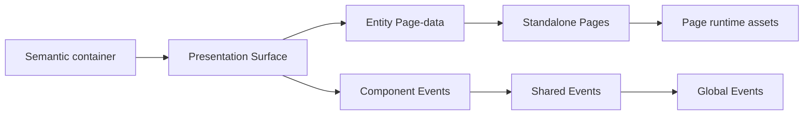

# Architecture

This section describes the runtime architecture that connects OntoBDC's semantic data, Presentation Surfaces, Pages, and browser event boundaries.

## Current architecture references

- [Page generation architecture](page-generation.md) — `DataEntity` discovery, per-entity Page-data state machines, publication, isolated contexts, and Page script generation.
- [Event promotion architecture](event-promotion.md) — Component-to-Shared promotion, runtime boundaries, and repository responsibilities.
- [Architecture Decision Records](adr/index.md) — normative architectural decisions, their rationale, rejected alternatives, and consequences.
- [Presentation events](../02-concepts/presentation-events.md) — event types, scopes, terminology, and persistence semantics.
- [State machines](../02-concepts/state-machines.md) — common orchestration model used by Surface and Page generation.

The released View source of truth for the Page and Surface material in this section is `EliasMPJunior/ontobdc-view@r008/v0.9`.
