<div align="left">
  <a href="../"><kbd>↑ Up</kbd></a>
</div>

# Page generation architecture

An **entityPage** is a standalone HTML representation of one semantic entity. It is a document in its own right and can therefore be opened directly, independently of the Presentation Surface. In the usual navigation flow, however, an entityPage is reached from the corresponding entity **Tile** rendered on the Surface.

At presentation level, an entityPage is organized into three main regions: **header**, **body**, and **footer**. The header provides navigation context through the breadcrumb and concentrates the operational controls exposed by the Page.

```text
EntityPage
├── header
│   ├── breadcrumb
│   │   ├── back to Surface
│   │   └── current entityPage
│   └── operational controls
│       ├── data connection
│       │   ├── status
│       │   └── connect folder
│       ├── refresh data
│       ├── filter
│       ├── add task
│       ├── print
│       ├── open workbook
│       └── fullscreen
├── body
│   └── dimension presentation
└── footer
    └── footer content
```

The breadcrumb identifies the navigation relationship between the Surface and the current entityPage, while the operational area groups actions that affect the Page or its connected data.

## Header

The **header** is the upper navigation and operation region of an EntityPage. In the current standalone Page templates it is rendered by `<header class="onto-page-header">`, while the shared header styling is defined in [`page_chrome.css`](https://github.com/EliasMPJunior/ontobdc-view/blob/master/src/ontobdc_view/page/asset/page_chrome.css).

The header is divided into two functional groups: the **breadcrumb** and the **operational controls**.

### Breadcrumb

The breadcrumb keeps the EntityPage connected to its navigation context. It provides the **back to Surface** control and identifies the **current EntityPage**. The back control points to the generated Surface `index.html`, while the breadcrumb presents the Surface as the parent context and the current EntityPage as the active location.

### Operational controls

The operational controls occupy the action area of the header and operate on the Page or on the data source connected to it.

- **data connection**
  - **status** — indicates the current connection state;
  - **connect folder** — starts the local folder connection used by the Page;
- **refresh data** — reloads Page data from the connected source;
- **filter** — opens the Page filtering controls;
- **add task** — adds a task;
- **print** — prints the Page presentation;
- **open workbook** — opens the connected workbook;
- **fullscreen** — switches the Page presentation to fullscreen mode.

The exact set of operational controls rendered by a concrete EntityPage is defined by its Page template. The shared header structure and chrome remain the same.

## Body

The **body** is composed of projections of the EntityPage dimensions.

The standard projection presents the dimension **title** and **description** first. Below them, the file area is divided between the file trees and the selected-file area. The file trees are organized as **Related**, **Suggested**, and **Found**. A selected file is visualized to the right, with the **annotation controls** directly below the visualization.

```text
standard dimension projection
├── title
├── description
└── file area
    ├── file trees
    │   ├── related
    │   ├── suggested
    │   └── found
    └── selected file
        ├── file visualization
        └── annotation controls
```

### `ontobdc view` execution trace

The sequence below starts at command routing, after the CLI has removed its global output and logging flags from the argument list.

1. **Resolve the `view` command.** `CliCommandRunAdapter.make(..., defer_check=True)` discovers the command plugins, selects `ContainerViewCommand` through `accepts(args)`, creates the `CliCommandRequest` and its `CliContextAdapter`, and instantiates the command.
2. **Bind and validate the command parameters.** The parameter-validation stage writes explicit values into the context and executes the relevant parameter strategies. `ContainerViewCommand.check()` then clears stale `container_id` / `container_path` values, executes `ContainerIdStrategy`, resolves the target container, accepts only `html` representation and `standard` view type, resolves the language, and stores those values in the context.
3. **Remove stale generated presentation files.** `ContainerViewCommand.run()` removes an existing `index.html` and the root-level `onto-file-viewer.html` when they exist.
4. **Reset the previous `DATA_GATHERED` ETL state.** The command removes `DataGatheredCapability.state_directory(context)` when present so the next generation cannot reuse that ETL artefact from an earlier run.
5. **Start Surface generation.** The command creates `SurfaceGenerationStateTransitionHandler(context)` and calls `execute()`. The handler creates a `StateWorkerAdapter` using [`standard_surface_html.yaml`](https://github.com/EliasMPJunior/ontobdc-wip/blob/master/src/ontobdc/view/domain/machine/standard_surface_html.yaml). The YAML declares `undefined` as the initial state, but at runtime `StateWorkerAdapter` first evaluates `handler.current_state` and replaces the statechart initial state with the latest cumulatively satisfied Surface state before execution begins.
6. **Reach `container_healthy`.** The evaluator checks [`ContainerHealthyCapability`](https://github.com/EliasMPJunior/ontobdc-wip/blob/master/src/ontobdc/storage/plugin/capability/transformation/container_healthy.py). If the container is not already healthy, the transition executes six capabilities in sequence: `ContainerMetadataReadyCapability`, `ContainerStorageIndexReadyCapability`, `ContainerDataPackageUpdatedCapability`, `ContainerManifestSyncedCapability`, `ContainerDataPackageFrictionlessValidCapability`, and `ContainerDataPackageRoCrateSyncedCapability`. Together they repair or validate the container metadata, storage-index entry, Data Package, RO-Crate manifest, Frictionless compatibility, and synchronization between the Data Package and the RO-Crate. This state can already be satisfied when the command starts and is then reused rather than transformed again.
7. **Reach `is_publishable`.** [`IsPublishableCapability`](https://github.com/EliasMPJunior/ontobdc-wip/blob/master/src/ontobdc/view/plugin/capability/transformation/is_publishable.py) checks whether the publication descriptor describes exactly the expected local resources. If it is not already satisfied, `ensure_publishable()` resolves the container metadata, synchronizes the Data Package, and then reapplies the Frictionless-valid and RO-Crate-synchronized hotfixes because the generic Data Package synchronization is format-blind and could otherwise reintroduce resources that the healthy-container step intentionally pruned. This state can also already be satisfied and reused.
8. **Generate `data_gathered`.** [`DataGatheredCapability`](https://github.com/EliasMPJunior/ontobdc-wip/blob/master/src/ontobdc/view/plugin/capability/transformation/data_gathered.py) loads the container `container.ttl` into an RDF graph, merges the registered datasets' `dataset.ttl` graphs and their current facade-mapped field values, adds the Surfaceable declarations used by the current matching path, adds the aggregate `obdc:FileTree`, and adds one typed entity for each file together with its path and file size. The resulting graph is serialized as JSON-LD to `.__ontobdc__/etl/view/surface/__data_gathered__.jsonld`. This state is regenerated in this invocation because step 4 removed its previous ETL state directory.
9. **Initialize the Surface.** [`SurfaceInitializedCapability`](https://github.com/EliasMPJunior/ontobdc-wip/blob/master/src/ontobdc/view/plugin/capability/transformation/surface_initialized.py) creates the minimal offline HTML document with `make_initial_html(language)`, marks it as `surface_initialized`, writes it to the Surface path (`index.html` for this command), and runs the `surface_initialized` check against the written document.
10. **Enrich the Surface.** [`SurfaceEnrichedCapability`](https://github.com/EliasMPJunior/ontobdc-wip/blob/master/src/ontobdc/view/plugin/capability/transformation/surface_enriched.py) reads the `DATA_GATHERED` JSON-LD artefact from disk, reads the generated Surface HTML, inserts or replaces the `application/ld+json` script identified by the Surface JSON-LD slot, changes the state marker to `surface_enriched`, writes the document, and validates the resulting state.
11. **Set the Surface configuration.** [`SurfaceSetCapability`](https://github.com/EliasMPJunior/ontobdc-wip/blob/master/src/ontobdc/view/plugin/capability/transformation/surface_set.py) reads the Surface configuration from `SurfaceContextAdapter`, normalizes it with `normalize_surface_config()`, embeds the normalized configuration in the HTML under the Surface configuration JSON slot, advances the state marker to `surface_set`, writes the document, and validates the resulting state.
12. **Resolve the Surface branding.** [`SurfaceBrandedCapability`](https://github.com/EliasMPJunior/ontobdc-wip/blob/master/src/ontobdc/view/plugin/capability/transformation/surface_branded.py) determines whether the current product is OntoBDC or InfoBIM and resolves both the brand and logotype SVG assets. Resolution follows the implemented precedence: container asset, workspace asset, official product page, then the configured InfoBIM GitHub fallback when applicable, and finally a valid empty SVG as the last resort. Downloaded or fallback assets are written into the container's product asset directory. The capability then advances the Surface state marker to `surface_branded`, writes the document, and checks that the state was reached.
13. **Match presentation data to Components.** [`SurfaceMatchedCapability`](https://github.com/EliasMPJunior/ontobdc-wip/blob/master/src/ontobdc/view/plugin/capability/transformation/surface_matched.py) reloads the `DATA_GATHERED` JSON-LD as an RDF graph and obtains either explicit Surface match requests from the context or the default automatically generated requests. Automatic matching considers entities whose RDF types are declared `obdc:SurfaceableEntity`, resolves compatible Components through `ComponentLoader`, and also adds the registered file-size and file-viewer Tile requests when available. Each request is resolved to a concrete HTML Component, ordered by the most specific `required_uris` match and then by component ID, with its size envelope applied. The normalized match list is embedded in the Surface HTML, the state marker advances to `surface_matched`, and the result is written and validated.

### Activity diagram

```mermaid
flowchart TD
    subgraph S3["3. Remove stale generated presentation files"]
        O{"Existing index.html?"}
        P["Remove index.html"]
        Q{"Root onto-file-viewer.html?"}
        R["Remove root file viewer"]
        S{".__ontobdc__/onto-file-viewer.html exists?"}
        T["Remove marker-directory file viewer"]
        O -->|Yes| P --> Q
        O -->|No| Q
        Q -->|Yes| R --> S
        Q -->|No| S
        S -->|Yes| T --> V
        S -->|No| V
    end

    subgraph S4["4. Reset previous DATA_GATHERED ETL state"]
        V["Resolve DataGatheredCapability.state_directory(context)"]
        W{"ETL state directory exists?"}
        X["remove_directory_tree(etl_state_directory)"]
        V --> W
        W -->|Yes| X --> Y
        W -->|No| Y
    end

    subgraph S5["5. Start Surface generation"]
        Y["Create SurfaceGenerationStateTransitionHandler(context)"]
        Z["Call handler.execute()"]
        AA["Create StateWorkerAdapter and load standard_surface_html.yaml"]
        AB["Read handler.current_state from cumulative state evaluation"]
        AC["Load Sismic statechart"]
        AD["Replace root initial state with observed current state"]
        AE["Start interpreter from that state"]
        Y --> Z --> AA --> AB --> AC --> AD --> AE --> AF
    end

    subgraph S6["6. Reach container_healthy"]
        AF{"Observed initial state is container_healthy or later?"}
        AG["Reuse the already satisfied container_healthy state"]
        AH["Transition from undefined to container_healthy"]
        AI["CapabilityExecutor.execute(ContainerHealthyCapability)"]
        AJ["ContainerMetadataReadyCapability"]
        AK["ContainerStorageIndexReadyCapability"]
        AL["ContainerDataPackageUpdatedCapability"]
        AM["ContainerManifestSyncedCapability"]
        AN["ContainerDataPackageFrictionlessValidCapability"]
        AO["ContainerDataPackageRoCrateSyncedCapability"]
        AP(["Continue to step 7"])
        AF -->|Yes| AG --> AP
        AF -->|No| AH --> AI --> AJ --> AK --> AL --> AM --> AN --> AO --> AP
    end
```



---

See the [Reference](../05-reference/) for implementation-level contracts and the [Architecture](index.md) section for the surrounding OntoBDC architecture.
