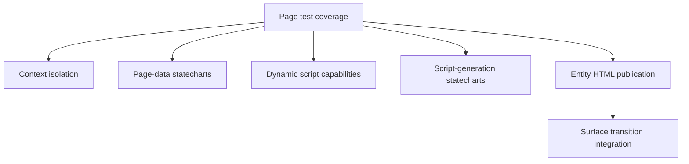

# Testing `ontobdc-view`

## Current Page-generation test layers

The `r008/v0.9` Page work is tested at multiple boundaries rather than only by isolated capability mocks.



| Test | What it establishes |
| --- | --- |
| `test_work_stream_page_data.py` | `PageDataContextAdapter` keeps writes out of the parent context; the WorkStream YAML statechart executes its six Page-data capabilities in order and produces the expected payload. |
| `test_ifc_work_schedule_page_data.py` | The IfcWorkSchedule-owned state type and statechart resolve their configured capabilities independently. |
| `test_script_assets_are_dynamic.py` | Generic SheetJS/i18n capabilities use the builder package and view directory supplied by context; graph-reader generation remains an explicit no-file stub. |
| `test_work_stream_script_generation.py` | WorkStream script generation writes SheetJS then WorkStream i18n and returns those paths. |
| `test_ifc_work_schedule_script_generation.py` | IfcWorkSchedule generation writes SheetJS then Gantt i18n, reaches the graph-reader stub state, and creates no `graph_reader.js`. |
| `test_entity_views_published.py` | Page-data JSON-LD becomes safe, template-rendered sibling HTML; the WorkStream document is fully materialized and read-only; entity script generation runs; and the outer Surface transition reaches `ENTITY_VIEWS_PUBLISHED`. |

This test shape mirrors the architecture: generic capabilities are exercised through the entity-owned statecharts that provide their isolated runtime context.

## Known RDFLib warnings when running `ontobdc dev test`

Running the complete `ontobdc-view` test suite with:

```text
ontobdc dev test
```

may complete successfully while reporting **10 warnings** similar to:

```text
DeprecationWarning: ConjunctiveGraph is deprecated, use Dataset instead.
```

These warnings are currently emitted by RDFLib while parsing JSON-LD. They do **not** represent ten independent defects in `ontobdc-view`, and they are not generated by `ontobdc-dev` itself.

### Why `ontobdc dev test` shows them

The `ontobdc-dev` test command delegates execution to pytest. For the complete suite it effectively runs:

```text
python -m pytest test -v
```

Therefore warnings produced by tested code or dependencies are reported directly by pytest.

### Trigger

The warnings occur when RDFLib executes JSON-LD parsing through code equivalent to:

```python
from rdflib import Graph

graph = Graph()
graph.parse(path, format="json-ld")
```

Although `ontobdc-view` instantiates `Graph`, RDFLib's JSON-LD parser internally reaches its deprecated `ConjunctiveGraph` implementation and emits the warning.

### Why there are exactly 10 warnings

With the current `r008/v0.9` test suite, the known count is:

| Test module | JSON-LD parses producing the warning | Reason |
| --- | ---: | --- |
| `test_data_gathered.py` | 3 | Three tests parse the JSON-LD state produced by `DataGatheredCapability` back into an RDFLib graph. |
| `test_surface_matched.py` | 7 | Seven tests execute `SurfaceMatchedCapability`, whose gathered-graph path reads the `DATA_GATHERED` state with RDFLib JSON-LD parsing. |
| **Total** | **10** | **3 + 7** |

The Page-generation tests listed above do not add RDFLib JSON-LD parses to this known-warning count: they either operate on Python JSON, patch the Facade lookup boundary, or test generated files/statechart execution directly.

### Do not replace `Graph` with `Dataset` only to hide the warning

Changing application code mechanically from `Graph()` to `Dataset()` only to suppress this warning is not an architectural fix. With the affected RDFLib behavior, JSON-LD parsing can still traverse deprecated internals.

Treat the warning as a known dependency warning until RDFLib changes that parser path or OntoBDC adopts a different parsing strategy for an independent architectural reason.

### Interpretation during development

A successful test run accompanied only by these ten known RDFLib deprecation warnings means pytest executed normally and the warning count is explained by repeated use of the same dependency path. If the warning text, count, or category changes, investigate the new output rather than assuming it belongs to this known case.
