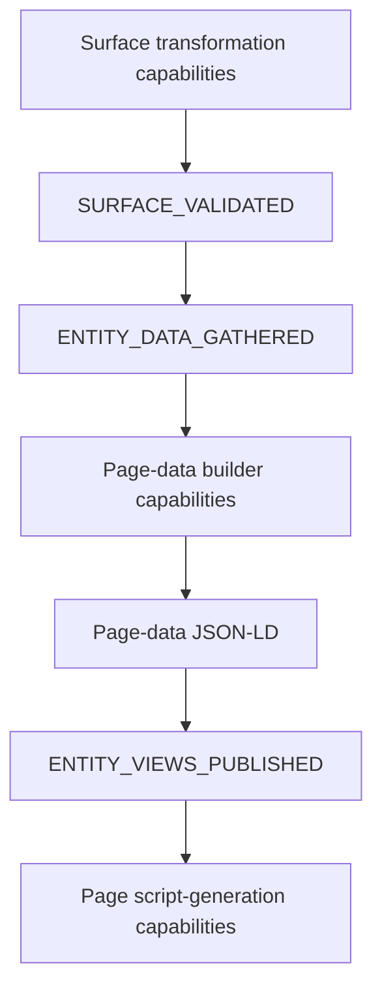

# Capability reference

OntoBDC capabilities are independently discoverable operations with stable `METADATA.id` identities. The current View package uses transformation capabilities at two nested levels: the outer **Surface** generation process and the inner **Page** builders.



## View capability families

| Family | Reference | Responsibility |
| --- | --- | --- |
| Surface transformations | [Surface transformation capabilities](surface/transformation/index.md) | Build, package, validate, and publish the offline Presentation Surface and entity Pages. |
| Page transformations | [Page transformation capabilities](page/transformation/index.md) | Build one entity's Page-data payload and generate builder-owned browser assets. |

All View capability IDs continue to use the common prefix:

```text
org.ontobdc.view.plugin.capability.transformation.target.<state>
```

Discovery is handled by the shared [Capability Loader](../03-loader/capability-loader.md); Page-specific handler and script-generator discovery are documented in the [Loader reference](../03-loader/index.md).
