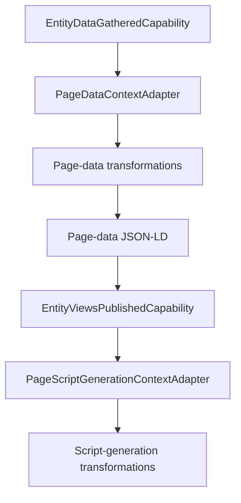

# Page capabilities

The Page capability family owns transformations that run inside entity-specific Page builders. These operations reuse the same OntoBDC `TransformationCapability` and `CapabilityLoader` contracts as Surface generation, but execute against isolated per-element or per-builder contexts.

See the [Page transformation capability reference](transformation/index.md) for the active generic transformations and the [Page generation architecture](../../../03-architecture/page-generation.md) for how they are composed by WorkStream and IfcWorkSchedule builders.
