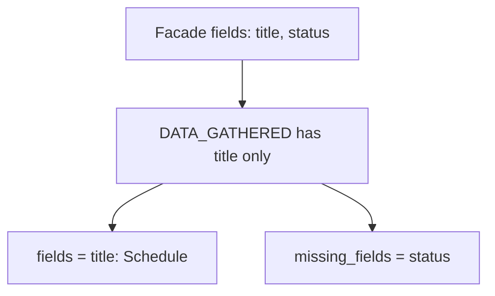

# Facade Data Gathered

`FacadeDataGatheredCapability` takes the Facades resolved by the previous state and collects the mapped values that already exist on the current `DATA_GATHERED` element node.

| Property | Value |
| --- | --- |
| Capability ID | `org.ontobdc.view.plugin.capability.transformation.target.facade_data_gathered` |
| Capability type | `TransformationCapability` |
| Resulting state | `__facade_data_gathered__` |
| Implementation | [`facade_data_gathered.py`](https://github.com/EliasMPJunior/ontobdc-view/blob/r008/v0.9/src/ontobdc_view/page/plugin/capability/transformation/facade_data_gathered.py) |

## Transformation

```mermaid
flowchart LR
    A[payload.facades] --> C[For each Facade field]
    B[page_source_node] --> C
    C --> D{mapped property present?}
    D -->|yes| E[payload.fields[name] = value]
    D -->|no| F[payload.missing_fields += name]
```

The capability reads only the first value associated with each mapped property. When that value is a JSON-LD object, `@value` is preferred and `@id` is accepted as a fallback. Scalar values are converted to strings.

After execution the payload contains both:

- `fields`: a mapping of Facade field identifiers to resolved string values;
- `missing_fields`: a list of field identifiers whose mapped property could not be resolved on the source node.

This explicit split is the handoff to `MissingDataFilledCapability`: already-known values are not recomputed, while unresolved fields remain visible.

## Satisfaction check

`check()` requires `fields` to be a dictionary and `missing_fields` to be a list. `is_satisfied()` delegates to `check()`.

## Example



The integrated WorkStream and IfcWorkSchedule Page-data tests verify this exact payload shape through the real statechart.
