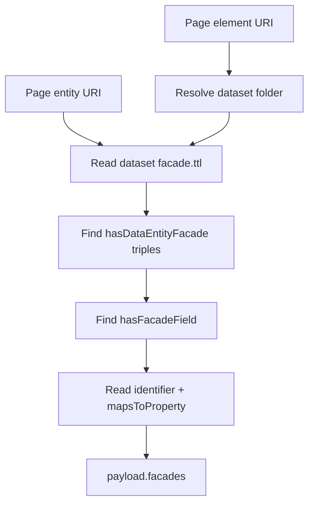

# Facades Located

`FacadesLocatedCapability` locates every Facade the dataset declares for the current Page element's concrete entity type and stores the normalized declarations in the isolated Page-data payload.

| Property | Value |
| --- | --- |
| Capability ID | `org.ontobdc.view.plugin.capability.transformation.target.facades_located` |
| Capability type | `TransformationCapability` |
| Resulting state | `__facades_located__` |
| Implementation | [`facades_located.py`](https://github.com/EliasMPJunior/ontobdc-view/blob/r008/v0.9/src/ontobdc_view/page/plugin/capability/transformation/facades_located.py) |
| Main collaborator | `FacadeLookupAdapter` |

## Data flow



`FacadeLookupAdapter` resolves the dataset directory using the same element-URI convention as the Page payload adapters: the second-to-last URI segment is treated as the dataset folder below `container_path`. It reads:

```text
<dataset>/.__ontobdc__/linkset/facade.ttl
```

Unlike the older data-gathering path that assumed the first Facade, this adapter returns **every** `hasDataEntityFacade` object declared for the entity type.

Each payload entry has the form:

```json
{
  "facade": "<facade URI>",
  "fields": [
    {"name": "<field identifier>", "mapped_property": "<property URI>"}
  ]
}
```

Missing dataset paths, missing `facade.ttl`, RDF parse failures, and entity types with no declared Facade all resolve to an empty list rather than raising.

## Satisfaction check

`check()` is satisfied whenever `payload["facades"]` is a list, including an empty list. `is_satisfied()` delegates directly to `check()`.

## Tests

The WorkStream and IfcWorkSchedule Page-data statechart tests patch only the Facade lookup boundary and execute this real capability through `CapabilityExecutor`, verifying that it is the first transformation in both machines.
