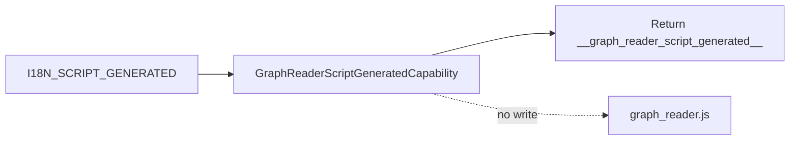

# Graph Reader Script Generated

`GraphReaderScriptGeneratedCapability` declares the final state of the current WorkStream and IfcWorkSchedule Page script-generation machines: generation of the browser script that reads the Page JSON-LD graph.

| Property | Value |
| --- | --- |
| Capability ID | `org.ontobdc.view.plugin.capability.transformation.target.graph_reader_script_generated` |
| Capability type | `TransformationCapability` |
| Resulting state | `__graph_reader_script_generated__` |
| Implementation | [`graph_reader_script_generated.py`](https://github.com/EliasMPJunior/ontobdc-view/blob/r008/v0.9/src/ontobdc_view/page/plugin/capability/transformation/graph_reader_script_generated.py) |
| Current status | Stub; no script file is generated |

## Current contract



`execute()` returns only:

```json
{"resulting_state": "__graph_reader_script_generated__"}
```

It does not call `PageScriptAssetAdapter`, does not write `graph_reader.js`, and does not return `generated_script_path`.

`check()` and `is_satisfied()` return `False` unconditionally.

The WorkStream and IfcWorkSchedule script transition handlers explicitly special-case this state: absence of `generated_script_path` is accepted for `GRAPH_READER_SCRIPT_GENERATED`, while it would be an error for the two preceding states. As a result, both statecharts reach their final state today even though only SheetJS and i18n files are physically generated.

`test_script_assets_are_dynamic.py` asserts the stub behavior directly, and the IfcWorkSchedule script-generation test asserts that no `graph_reader.js` exists after the machine completes.
