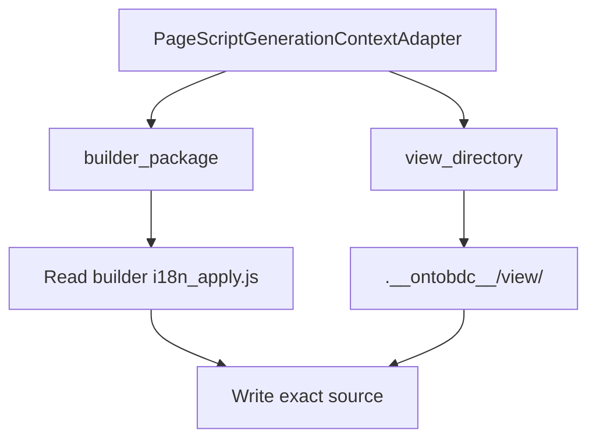

# I18n Script Generated

`I18nScriptGeneratedCapability` publishes the active Page builder's `i18n_apply.js` into its generated view directory.

| Property | Value |
| --- | --- |
| Capability ID | `org.ontobdc.view.plugin.capability.transformation.target.i18n_script_generated` |
| Capability type | `TransformationCapability` |
| Resulting state | `__i18n_script_generated__` |
| Implementation | [`i18n_script_generated.py`](https://github.com/EliasMPJunior/ontobdc-view/blob/r008/v0.9/src/ontobdc_view/page/plugin/capability/transformation/i18n_script_generated.py) |
| Main collaborator | `PageScriptAssetAdapter` |

## Dynamic source selection

The generic capability therefore produces entity-specific code. Current tests prove that:

- WorkStream output contains `OntoBDCWorkStreamViewRuntime` and not the Gantt runtime name;
- IfcWorkSchedule output contains `OntoBDCGanttViewRuntime`;
- a synthetic custom builder can supply its own i18n source and output directory.

## Result and check

`execute()` returns `generated_script_path` and `__i18n_script_generated__`. `check()` compares the generated file byte-for-text with the active builder's packaged source, not merely file existence.
