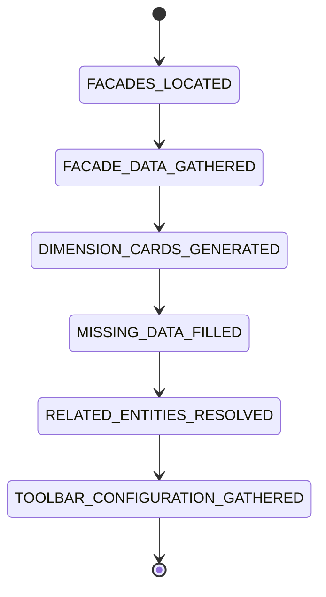
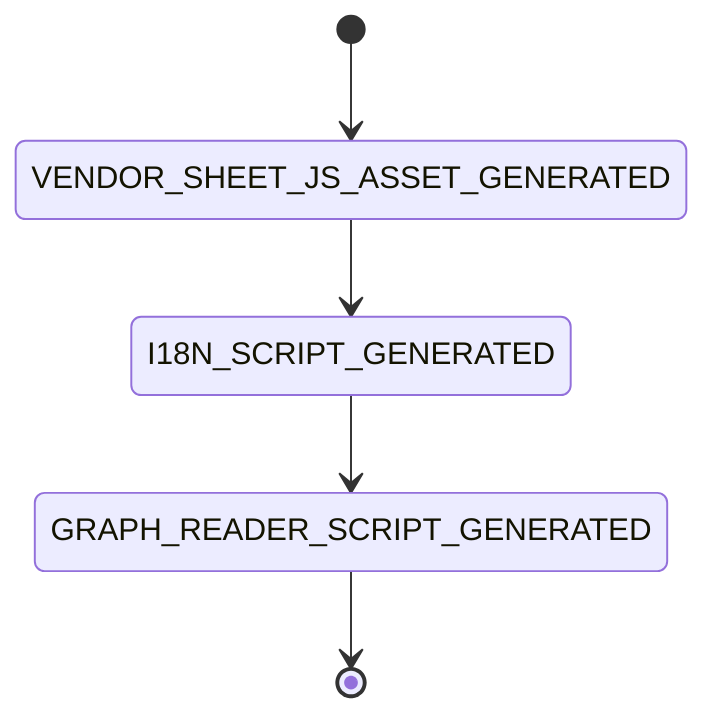
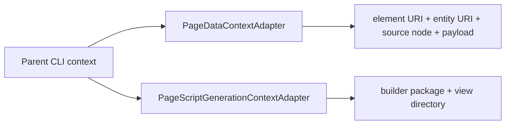

# Page transformation capabilities

`ontobdc-view@r008/v0.9` exposes reusable Page transformations plus entity-specific capabilities where the entity semantics require them. Page-data machines choose their own ordered state sequence; script-generation machines use the shared asset-generation sequence.

All use the shared capability ID namespace:

```text
org.ontobdc.view.plugin.capability.transformation.target.<state>
```

## Page-data sequence



| Capability | Resulting state | Current effect |
| --- | --- | --- |
| [Facades Located](facades-located.md) | `__facades_located__` | Loads every declared Facade for the element's entity type. |
| [Facade Data Gathered](facade-data-gathered.md) | `__facade_data_gathered__` | Collects mapped values already present on the `DATA_GATHERED` node and records missing fields. |
| `DimensionCardsGeneratedCapability` | `__dimension_cards_generated__` | Builds the ordered dimension-card model from Facade dimension mappings. |
| [Missing Data Filled](missing-data-filled.md) | `__missing_data_filled__` | Stub/no-op; no secondary source is defined yet. |
| [Related Entities Resolved](related-entities-resolved.md) | `__related_entities_resolved__` | Placeholder; ensures `related_entities` is a list, currently defaulting to empty. |
| [WorkStream Related Entities Resolved](work-stream-related-entities-resolved.md) | `__related_entities_resolved__` | WorkStream override that materializes resources, related/suggested linksets, and annotations. |
| `ToolbarConfigurationGatheredCapability` | `__toolbar_configuration_gathered__` | Embeds the ontology-backed toolbar configuration in Page data. |

The diagram is the current WorkStream sequence. Other builders own their own state types and YAML statecharts and may use a different subset. The WorkStream handler overrides the conventional capability ID for `RELATED_ENTITIES_RESOLVED`; no entity-specific branch is hard-coded inside the generic relation stub.

## Script-generation sequence



| Capability | Resulting state | Current effect |
| --- | --- | --- |
| [Vendor SheetJS Asset Generated](vendor-sheet-js-asset-generated.md) | `__vendor_sheet_js_asset_generated__` | Copies the active builder's vendored SheetJS source to its generated view directory. |
| [I18n Script Generated](i18n-script-generated.md) | `__i18n_script_generated__` | Copies the active builder's `i18n_apply.js`. |
| [Graph Reader Script Generated](graph-reader-script-generated.md) | `__graph_reader_script_generated__` | Stub; final transition exists but no graph-reader file is written yet. |

## Isolated execution contexts

Reusable capabilities do not hard-code a concrete entity. Their entity/build-specific inputs are injected through isolated overlays; capabilities whose semantics really are entity-specific have an explicit entity-qualified ID:



Writes to those overlays do not mutate the parent command context. This lets `EntityDataGatheredCapability` run multiple element builders concurrently and lets the same script-generation capabilities operate on multiple entity builders.

## Current implementation status

Missing-data enrichment remains an intentional placeholder. Generic semantic relation resolution also remains a placeholder, but WorkStream now supplies its concrete relation/read-model capability. The script sequence still terminates in a graph-reader placeholder; the WorkStream page does not need it because its visible DOM is materialized from Page-data by Jinja.

See [WorkStream Page data](../../../04-state-machines/work-stream-page-data.md), [IfcWorkSchedule Page data](../../../04-state-machines/ifc-work-schedule-page-data.md), [WorkStream script generation](../../../04-state-machines/work-stream-script-generation.md), and [Gantt script generation](../../../04-state-machines/gantt-script-generation.md).
