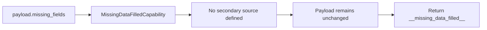

# Missing Data Filled

`MissingDataFilledCapability` is the declared enrichment boundary for Facade fields that were absent from the `DATA_GATHERED` node.

| Property | Value |
| --- | --- |
| Capability ID | `org.ontobdc.view.plugin.capability.transformation.target.missing_data_filled` |
| Capability type | `TransformationCapability` |
| Resulting state | `__missing_data_filled__` |
| Implementation | [`missing_data_filled.py`](https://github.com/EliasMPJunior/ontobdc-view/blob/r008/v0.9/src/ontobdc_view/page/plugin/capability/transformation/missing_data_filled.py) |
| Current status | Stub / no-op |

## Current behavior

No secondary data source has been selected yet. `execute()` merely verifies that a Page-data payload can be accessed and returns the resulting-state value. It does not remove names from `missing_fields` or add values to `fields`.

## Satisfaction check

`check()` and `is_satisfied()` both return `False` unconditionally. The enclosing Page-data state machines can still execute the transition because transition validation is based on successful capability execution inside the current statechart tick, not on an artifact-level re-evaluation.

This state should not be documented as evidence that missing data was actually enriched yet. Its purpose today is to keep the intended architectural boundary explicit while the data source and enrichment policy are decided.
