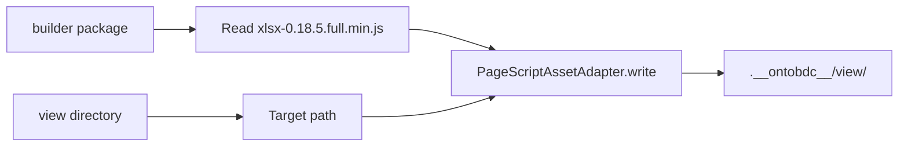

# Vendor SheetJS Asset Generated

`VendorSheetJsAssetGeneratedCapability` publishes the vendored SheetJS source owned by the active Page builder into that builder's generated view directory.

| Property | Value |
| --- | --- |
| Capability ID | `org.ontobdc.view.plugin.capability.transformation.target.vendor_sheet_js_asset_generated` |
| Capability type | `TransformationCapability` |
| Resulting state | `__vendor_sheet_js_asset_generated__` |
| Implementation | [`vendor_sheet_js_asset_generated.py`](https://github.com/EliasMPJunior/ontobdc-view/blob/r008/v0.9/src/ontobdc_view/page/plugin/capability/transformation/vendor_sheet_js_asset_generated.py) |
| Main collaborator | `PageScriptAssetAdapter` |

## Dynamic builder resolution

The capability does not know whether it is generating a WorkStream or IfcWorkSchedule Page. `PageScriptGenerationContextAdapter` supplies the active builder package and view directory.

The target view directory must match `^[a-z][a-z0-9_]*$` through the shared adapter.

## Result and check

`execute()` returns `generated_script_path` and `__vendor_sheet_js_asset_generated__`. `check()` requires the target file to exist **and** its contents to exactly equal the current builder-packaged source. A stale or modified copy therefore fails the check.

`test_script_assets_are_dynamic.py` verifies that the same capability can publish a custom builder's SheetJS asset without any WorkStream/IfcWorkSchedule hard-coding.
