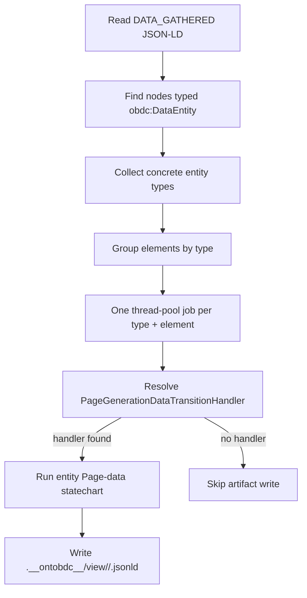
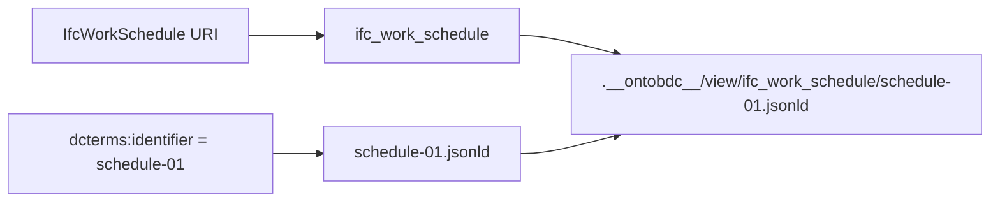

# Entity Data Gathered

`EntityDataGatheredCapability` is the bridge from the Surface-level `DATA_GATHERED` graph to entity-specific Page-data builders. It enumerates `obdc:DataEntity` nodes, groups them by concrete entity type, resolves a matching Page-data handler, and writes one Page-data JSON-LD artifact for each supported `(entity type, element)` pair.

| Property | Value |
| --- | --- |
| Capability ID | `org.ontobdc.view.plugin.capability.transformation.target.entity_data_gathered` |
| Capability type | `TransformationCapability` |
| Resulting state | `entity_data_gathered` |
| Implementation | [`entity_data_gathered.py`](https://github.com/EliasMPJunior/ontobdc-view/blob/r008/v0.9/src/ontobdc_view/surface/plugin/capability/transformation/entity_data_gathered.py) |
| Current status | Page-data materialization implemented; satisfaction check still stubbed |

## Pipeline position


## Operation



A node qualifies when its `@type` includes the URI represented by `StorageNamespaceBootstrap.OBDC.DataEntity`. Every other type on the node is treated as a concrete entity type. A multiply typed element can therefore participate in more than one entity group.

Jobs run through `ThreadPoolExecutor`; completion is collected with `as_completed()`. A worker must return the same element URI it received or execution fails with `ValueError`.

## Handler discovery

`EntityPageGenerationDataTransitionHandlerLoader` scans `<root_package>.page.plugin.builder` recursively and selects subclasses of `EntityPageGenerationDataTransitionHandler` whose class name exactly matches:

```text
<EntityLocalNameInPascalCase>PageGenerationDataTransitionHandler
```

Current matches include `WorkStreamPageGenerationDataTransitionHandler` and `IfcWorkSchedulePageGenerationDataTransitionHandler`. Missing handlers are not errors; the element is traversed but no Page-data file is written for that entity type.

See [Entity Page generation-data handler loader](../../../03-loader/entity-page-generation-data-handler-loader.md).

## Artifact path

```text
<container>/.__ontobdc__/view/<entity-segment>/<identifier>.jsonld
```

`<entity-segment>` normalizes the entity URI local name to lower snake case. `<identifier>` uses the first `dcterms:identifier` value when present, sanitized to `[A-Za-z0-9._-]`; otherwise it falls back to the sanitized local name of the element URI.



## Result

`execute()` returns traversal metadata rather than a Surface HTML marker:

| Field | Meaning |
| --- | --- |
| `source_state_path` | `DATA_GATHERED` JSON-LD source path. |
| `entity_count` | Number of concrete entity-type groups. |
| `element_count` | Number of `DataEntity` source records. |
| `entities` | Entity groups with the element URIs traversed for each. |
| `elements` | Every selected element with all of its concrete entity type URIs. |

## Satisfaction check

**Current behavior:** both `check()` and `is_satisfied()` return `False` unconditionally.

That means the Surface evaluator cannot infer `ENTITY_DATA_GATHERED` from existing Page-data files yet. The transition itself is implemented and writes artifacts; only the resumable artifact-level predicate is missing.

## Tests and downstream evidence

The current Page-data builder tests verify the isolated context and complete four-capability execution for both WorkStream and IfcWorkSchedule:

- [`test_work_stream_page_data.py`](https://github.com/EliasMPJunior/ontobdc-view/blob/r008/v0.9/test/unit/page/plugin/capability/transformation/test_work_stream_page_data.py)
- [`test_ifc_work_schedule_page_data.py`](https://github.com/EliasMPJunior/ontobdc-view/blob/r008/v0.9/test/unit/page/plugin/capability/transformation/test_ifc_work_schedule_page_data.py)

`EntityViewsPublishedCapability` tests also prove the next Surface transition consumes the generated `.__ontobdc__/view/**/*.jsonld` layout.
