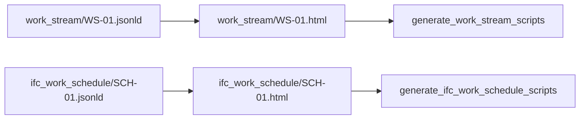
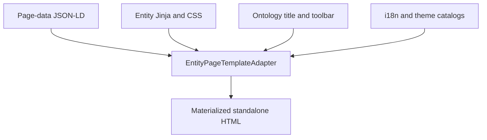
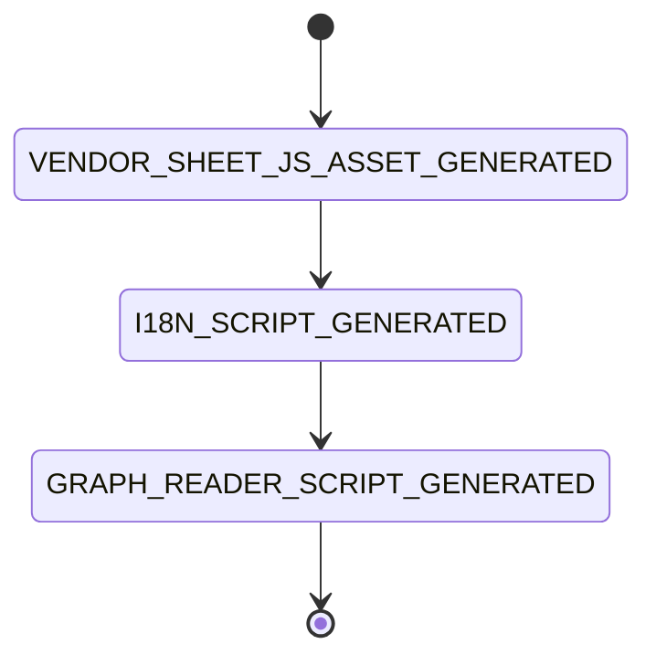

# Entity Views Published

`EntityViewsPublishedCapability` renders every generated Page-data JSON-LD artifact as a standalone HTML Page and then runs the script generator associated with each entity view directory.

| Property | Value |
| --- | --- |
| Capability ID | `org.ontobdc.view.plugin.capability.transformation.target.entity_views_published` |
| Capability type | `TransformationCapability` |
| Resulting state | `entity_views_published` |
| Implementation | [`entity_views_published.py`](https://github.com/EliasMPJunior/ontobdc-view/blob/r008/v0.9/src/ontobdc_view/surface/plugin/capability/transformation/entity_views_published.py) |
| Current status | Implemented Jinja publication + Page script generation |

## Inputs and outputs

The source set is every `*.jsonld` file recursively below:

```text
<container>/.__ontobdc__/view/
```

Each source is rendered beside itself with the suffix changed to `.html`.



## Publication operation

1. Resolve `language`, defaulting to `en`.
2. Collect all Page-data JSON-LD paths under `.__ontobdc__/view/`.
3. Read each payload and render its entity template through `EntityPageTemplateAdapter` in a `ThreadPoolExecutor`.
4. Sort the published path list for deterministic results.
5. Collect distinct source parent-directory names.
6. Resolve a script generator for each directory through `EntityPageScriptGeneratorLoader`.
7. Run every resolved generator and concatenate its returned asset paths.

## HTML publication contract

For each source, the adapter derives the packaged asset directory by convention:

```text
view/<entity>/<identifier>.jsonld
             │
             └── page/plugin/asset/entity/<entity>_view/<entity>_view.html.j2
```

The render context combines Page-data with ontology-backed entity titles and toolbar configuration, the shared Entity Page header and CSS, entity-specific CSS, localized strings, and the theme catalog. The resulting HTML contains the visible entity fields and entity-specific regions at publication time. It also retains the complete payload in `#ontobdc-page-jsonld` for semantic inspection and downstream consumers.



Embedded JSON is serialized with `ensure_ascii=False`, and `</` is replaced with `<\/` so a string containing `</script>` cannot terminate its script element.

For WorkStream, the HTML already contains the name, identifier, description, seven dimension cards, Related/Suggested/Found resource panels, previews, and persisted annotations when it is opened. No browser-side folder connection is involved. See [WorkStream Entity Page](../../../05-layout/work-stream-entity-page.md).

## Script generation

After HTML publication, the capability maps view directories to generator functions by convention. Current recognized directories are `work_stream` and `ifc_work_schedule`.

The active script machines run:



The graph-reader state is currently a stub, so a normal current run returns the generated SheetJS and i18n paths only. These are generator outputs, not evidence that the static WorkStream page reconnects to a workbook; the WorkStream DOM is already populated from its Page-data JSON-LD.

See [Entity Page script generator loader](../../../03-loader/entity-page-script-generator-loader.md), [Gantt script generation](../../../04-state-machines/gantt-script-generation.md), and [WorkStream script generation](../../../04-state-machines/work-stream-script-generation.md).

## Result

| Field | Meaning |
| --- | --- |
| `resulting_state` | `ENTITY_VIEWS_PUBLISHED` |
| `published_view_count` | Number of HTML files created. |
| `published_view_paths` | Sorted HTML paths. |
| `generated_script_paths` | Paths returned by all matching entity script generators. |

## Satisfaction check

`check()` is artifact-based. It returns `True` only when:

- at least one Page-data JSON-LD source exists; and
- every JSON-LD source has a sibling `.html` file.

It does not validate the contents of the HTML or whether the associated Page scripts exist.

## Tests

[`test_entity_views_published.py`](https://github.com/EliasMPJunior/ontobdc-view/blob/r008/v0.9/test/unit/surface/plugin/capability/transformation/test_entity_views_published.py) verifies that:

- one generated JSON-LD source becomes one sibling, template-rendered HTML Page;
- `language=pt-br` reaches the HTML element;
- the embedded JSON round-trips exactly;
- a payload containing `</script>` cannot escape the JSON-LD block;
- the WorkStream HTML is fully materialized with entity data, dimensions, resources, annotations, and disabled mutation controls;
- entity script generation returns its generated paths;
- `check()` is false when no Page-data JSON-LD exists;
- the Surface statechart really transitions from `ENTITY_DATA_GATHERED` to `ENTITY_VIEWS_PUBLISHED` and produces the HTML file.
