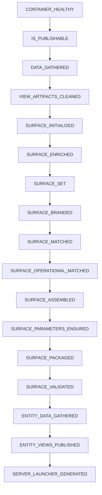
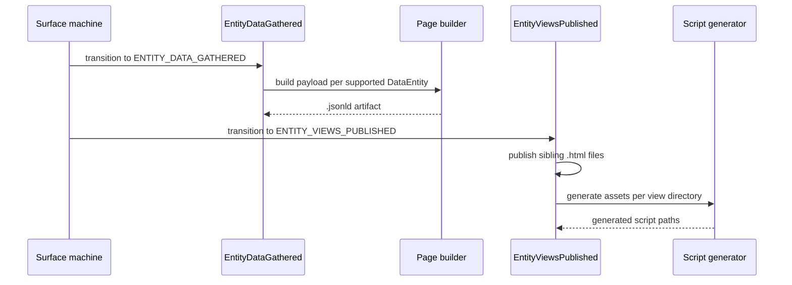

# Surface transformation capabilities

The Surface generation pipeline turns a healthy OntoBDC container into an offline HTML Presentation Surface and then materializes the entity Pages that belong to the same publication run. Each transition is implemented by a capability and follows `surface/domain/machine/standard_surface_html/statechart.yaml` in `ontobdc-view@r008/v0.9`.

## Execution order

| Order | Capability | Resulting state | Main effect |
| ---: | --- | --- | --- |
| 0 | `ContainerHealthyCapability` | `container_healthy` | External prerequisite supplied by `ontobdc`. |
| 1 | [Is Publishable](is-publishable.md) | `is_publishable` | Validates publication prerequisites. |
| 2 | [Data Gathered](data-gathered.md) | `data_gathered` | Materializes the presentation graph as JSON-LD. |
| 3 | [View Artifacts Cleaned](view-artifacts-cleaned.md) | `view_artifacts_cleaned` | Removes generated HTML/JS/CSS from the previous View run. |
| 4 | [Surface Initialized](surface-initialized.md) | `surface_initialized` | Creates the minimal offline HTML Surface document. |
| 5 | [Surface Enriched](surface-enriched.md) | `surface_enriched` | Embeds gathered JSON-LD. |
| 6 | [Surface Set](surface-set.md) | `surface_set` | Embeds normalized regions and presentation rules. |
| 7 | [Surface Branded](surface-branded.md) | `surface_branded` | Resolves branding resources. |
| 8 | [Surface Matched](surface-matched.md) | `surface_matched` | Matches presentation data to compatible Tiles. |
| 9 | [Surface Operational Matched](surface-operational-matched.md) | `surface_operational_matched` | Resolves the default operation region when required. |
| 10 | [Surface Assembled](surface-assembled.md) | `surface_assembled` | Materializes matched Tiles inside the Surface host. |
| 11 | [Surface Parameters Ensured](surface-parameters-ensured.md) | `surface_parameters_ensured` | Embeds URL-state defaults. |
| 12 | [Surface Packaged](surface-packaged.md) | `surface_packaged` | Embeds browser Components, the Component Event promoter, Global Event journal preparation, and the standalone file viewer. |
| 13 | [Surface Validated](surface-validated.md) | `surface_validated` | Re-runs the packaged-Surface checks. |
| 14 | [Entity Data Gathered](entity-data-gathered.md) | `entity_data_gathered` | Discovers `DataEntity` nodes and writes builder-produced Page-data JSON-LD files for supported entity types. |
| 15 | [Entity Views Published](entity-views-published.md) | `entity_views_published` | Publishes sibling HTML Pages and runs entity-specific Page script generators. |
| 16 | [Server Launcher Generated](server-launcher-generated.md) | `server_launcher_generated` | **Currently marker-only**; no `server.cmd` is written yet. |

## Nested Page execution

`ENTITY_DATA_GATHERED` and `ENTITY_VIEWS_PUBLISHED` are Surface states, but they delegate work to the Page subsystem.

## Observability and resumption

Most Surface capabilities implement an artifact-level `check(context)` and are therefore observable by `SurfaceGenerationStateEvaluatorAdapter`. The evaluator walks the state sequence and stops at the first failed check.

There is one important current exception: `EntityDataGatheredCapability.check()` and `is_satisfied()` return `False`. Its Page-data materialization is currently transition-driven rather than resumable through an artifact-level satisfaction predicate. `EntityViewsPublishedCapability`, by contrast, is observable: it requires at least one Page-data JSON-LD file and a sibling HTML file for every such source.

## Source of truth

These pages describe executable behavior in `EliasMPJunior/ontobdc-view@r008/v0.9`. Where a state description or docstring still describes an intended future artifact, the executable `execute()` and `check()` methods are treated as the current contract.
