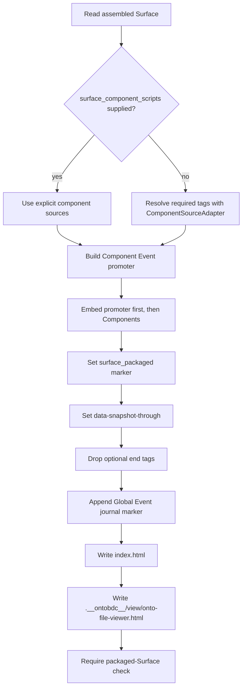
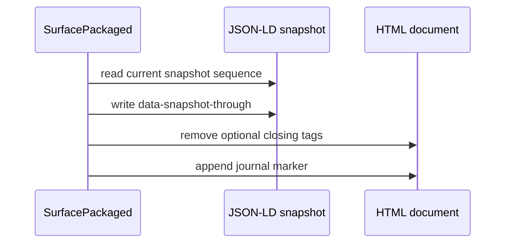

# Surface Packaged

`SurfacePackagedCapability` embeds the browser Component implementations required by the assembled Surface, installs the Component Event promoter, prepares the append-only Global Event journal boundary, and writes the standalone file viewer inside the generated View tree.

| Property | Value |
| --- | --- |
| Capability ID | `org.ontobdc.view.plugin.capability.transformation.target.surface_packaged` |
| Capability type | `TransformationCapability` |
| Resulting state | `surface_packaged` |
| Implementation | [`surface_packaged.py`](https://github.com/EliasMPJunior/ontobdc-view/blob/r008/v0.9/src/ontobdc_view/surface/plugin/capability/transformation/surface_packaged.py) |

## Packaging flow



## Component-source resolution

The optional `surface_component_scripts` context value may be a list of JavaScript strings or a mapping whose string values are JavaScript sources. Empty entries are ignored.

Without an override, the capability derives required custom-element tags from the document: `onto-presentation-surface` first, then every distinct matched Tile. `ComponentSourceAdapter.component_source(tag, root_path=context.root_path)` must resolve a non-empty source for every required tag; otherwise the automatic set is rejected.

The Component Event promoter is separate from that component set. It is built by `component.adapter.dock.component_event_promoter_source()` and embedded before the component implementations.

## Global Event journal preparation

The embedded Surface JSON-LD snapshot carries `data-snapshot-through`, representing the highest Global Event sequence already incorporated into the snapshot. Packaging preserves an existing value or writes `-1` when none exists.

The generated document then removes optional `</body>` and `</html>` end tags and appends:

```html
<!-- ontobdc:global-event-journal -->
```

This leaves future appended event blocks parsing as ordinary trailing body content rather than relying on browser error recovery after a closed `</html>` element.



Packaging prepares the journal but does **not** append a Global Event. The write-side listener/writer remains outside this capability.

## Standalone file viewer

The current file viewer path is:

```text
<container>/.__ontobdc__/view/onto-file-viewer.html
```

It is sourced from `ontobdc_view.page.plugin.asset.file_viewer_source()`. Unlike the earlier transitional implementation, the current `_write_file_viewer()` is not wrapped as best-effort: failure to source, create the directory, or write the file propagates and fails packaging.

The location keeps the generated viewer outside the container's ordinary data inventory while colocating it with other generated Pages.

## Result

The stable result fields are:

- `surface_path`;
- `component_script_count` — excluding the separately prepended promoter;
- `resulting_state`.

`_dbg_*` fields are runtime instrumentation and are not the stable semantic contract.

## Satisfaction check

The packaged-Surface check requires an assembled offline Surface with embedded Component scripts and the Component Event promoter marker. External HTTP(S) scripts/stylesheets and CSS `@import` remain invalid.

The check does not establish that the file viewer exists or that future Global Events can be persisted; those are separate artifact/runtime concerns.

## Tests

[`test_surface_packaged.py`](https://github.com/EliasMPJunior/ontobdc-view/blob/r008/v0.9/test/unit/surface/plugin/capability/transformation/test_surface_packaged.py) covers snapshot cursor handling, journal preparation/idempotence, required component discovery, promoter ordering, stale-script replacement, explicit and package-resolved Component sets, and the real packaged-Surface check.
