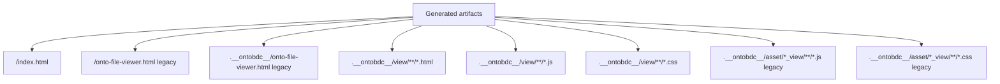

# View Artifacts Cleaned

`ViewArtifactsCleanedCapability` removes generated HTML, JavaScript, and CSS artifacts from a previous `ontobdc view` run before the new Surface is initialized.

| Property | Value |
| --- | --- |
| Capability ID | `org.ontobdc.view.plugin.capability.transformation.target.view_artifacts_cleaned` |
| Capability type | `TransformationCapability` |
| Resulting state | `view_artifacts_cleaned` |
| Implementation | [`view_artifacts_cleaned.py`](https://github.com/EliasMPJunior/ontobdc-view/blob/r008/v0.9/src/ontobdc_view/surface/plugin/capability/transformation/view_artifacts_cleaned.py) |

## Why it exists

`DATA_GATHERED` runs before cleanup, so the current source inventory can be materialized without a stale generated Surface being mistaken for user data. Cleanup then establishes a clean generated-output boundary before `SURFACE_INITIALIZED` creates a fresh `index.html`.

## Exact cleanup scope

`execute()` enumerates and removes these generated paths when they exist:

The current standalone file viewer at `.__ontobdc__/view/onto-file-viewer.html`, entity Pages, Page-data-adjacent runtime scripts, and generated Page CSS are therefore all disposable View output.

The legacy `.__ontobdc__/asset/*_view/` scan is intentionally restricted to directories whose names end in `_view`, and only JavaScript/CSS are removed there. Unrelated asset directories are not swept. HTML outside `.__ontobdc__/view/` is also left alone.

The capability removes files only; it does not recursively delete the generated directories themselves.

## Result

`execute()` returns:

| Field | Meaning |
| --- | --- |
| `resulting_state` | `VIEW_ARTIFACTS_CLEANED` |
| `container_path` | Resolved container root. |
| `removed_paths` | Every file actually removed. |

## Satisfaction check

This state occurs before a new Surface HTML marker exists, so `check()` is filesystem-based. It returns `True` exactly when none of the enumerated generated artifact paths currently exists as a file.

An unresolved `container_path` makes `check()` return `False`; `execute()` raises `ValueError` instead.

## Tests

[`test_view_artifacts_cleaned.py`](https://github.com/EliasMPJunior/ontobdc-view/blob/r008/v0.9/test/unit/surface/plugin/capability/transformation/test_view_artifacts_cleaned.py) uses real temporary files and verifies:

- current and both legacy file-viewer locations;
- entity HTML under `.__ontobdc__/view/`;
- generated JS/CSS under the current View tree;
- legacy JS/CSS under `.__ontobdc__/asset/*_view/`;
- preservation of unrelated HTML and unrelated asset-directory JavaScript;
- no-op behavior when nothing exists;
- `check()` satisfaction after a real cleanup.
