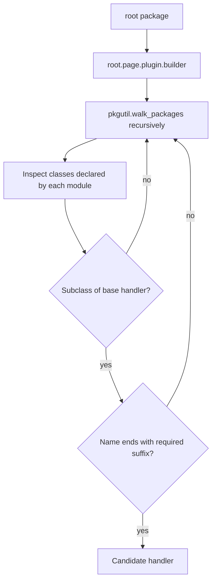
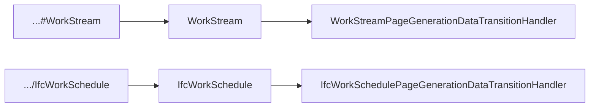

# Entity Page generation-data handler loader

`EntityPageGenerationDataTransitionHandlerLoader` resolves the builder responsible for materializing Page-data for one concrete entity type.

| Property | Value |
| --- | --- |
| Implementation | [`entity_data_gathered.py`](https://github.com/EliasMPJunior/ontobdc-view/blob/r008/v0.9/src/ontobdc_view/surface/plugin/capability/transformation/entity_data_gathered.py) |
| Default roots | `("ontobdc_view",)` |
| Scanned suffix | `page.plugin.builder` |
| Handler suffix | `PageGenerationDataTransitionHandler` |

## Discovery

Imported base classes are excluded by requiring `candidate.__module__ == module.__name__`. Results from `get_all()` are sorted by class name.

## Entity URI to class name

`get(entity_uri)` derives an exact expected class name from the URI local name:

Local-name extraction supports fragment (`#`), path (`/`), and colon-delimited forms. Non-alphanumeric separators are converted into PascalCase segments. Empty names or names that would produce a Python class beginning with a digit raise `ValueError`.

## Resolution rules

- no matching handler → `None`;
- exactly one matching handler → return its class;
- more than one exact match across configured roots → `ValueError`.

An optional missing builder package is tolerated. A `ModuleNotFoundError` raised **inside** an existing imported package is not swallowed; only absence of the requested package itself is treated as optional.

## Runtime role

`EntityDataGatheredCapability` calls this loader independently for each concrete entity type. A missing handler means that entity type is traversed but no Page-data artifact is written. A resolved handler executes its own Page-data statechart and writes to `.__ontobdc__/view/<entity>/<identifier>.jsonld`.
