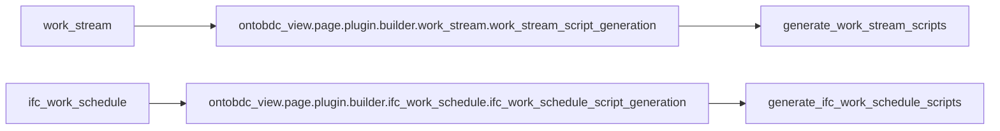

# Entity Page script generator loader

`EntityPageScriptGeneratorLoader` maps a generated entity view directory to the function that owns that Page's script-generation state machine.

| Property | Value |
| --- | --- |
| Implementation | [`page/adapter/script.py`](https://github.com/EliasMPJunior/ontobdc-view/blob/r008/v0.9/src/ontobdc_view/page/adapter/script.py) |
| Default roots | `("ontobdc_view",)` |
| View-directory syntax | `^[a-z][a-z0-9_]*$` |

## Naming convention

For a view directory `<view_directory>`, the loader imports:

```text
<root>.page.plugin.builder.<view_directory>.<view_directory>_script_generation
```

and looks for:

```text
generate_<view_directory>_scripts
```



## Resolution rules

- invalid view-directory syntax → `ValueError` before import;
- module absent under every root → `None`;
- exactly one callable generator → return it;
- more than one generator across roots → `ValueError`.

As with the Page-data handler loader, only absence of the requested optional module is swallowed. An import failure caused by a dependency inside an existing module propagates.

## PageScriptAssetAdapter

The same module defines `PageScriptAssetAdapter`, the shared file boundary used by the generic Page script capabilities.

```mermaid
flowchart TD
    A[PageScriptGenerationContextAdapter] --> B[builder_package]
    A --> C[view_directory]
    B --> D[importlib.resources.files(builder_package)]
    D --> E[Read <script_name>.js]
    C --> F[Target .__ontobdc__/view/<view>/<script_name>.js]
    E --> G[write]
    F --> G
```

`check()` verifies both existence and exact text equality with the current builder asset. This makes a stale generated script observably unsatisfied even when its filename still exists.

`EntityViewsPublishedCapability` invokes the loader once for every distinct parent directory containing Page-data JSON-LD sources after the sibling HTML Pages have been published.
