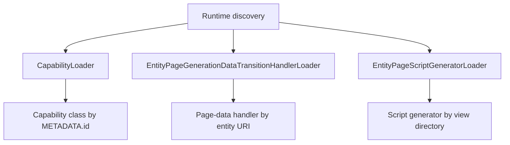

# Loaders

Loaders provide OntoBDC's runtime discovery boundaries. They locate implementations by metadata or naming convention so consumers do not need central registration tables or direct imports of every concrete plugin.

## Reference

- [Capability Loader](capability-loader.md) — discovers `Capability` plugins, validates metadata, deduplicates global IDs, and resolves classes by `METADATA.id`.
- [Entity Page generation-data handler loader](entity-page-generation-data-handler-loader.md) — discovers `<Entity>PageGenerationDataTransitionHandler` implementations below Page builders and resolves one by entity URI.
- [Entity Page script generator loader](entity-page-script-generator-loader.md) — resolves `generate_<view>_scripts` from the corresponding entity builder module.

The two Page loaders are intentionally narrower than `CapabilityLoader`: they discover composition hooks around capabilities, while the transformations executed inside those hooks still resolve through the normal capability registry.
