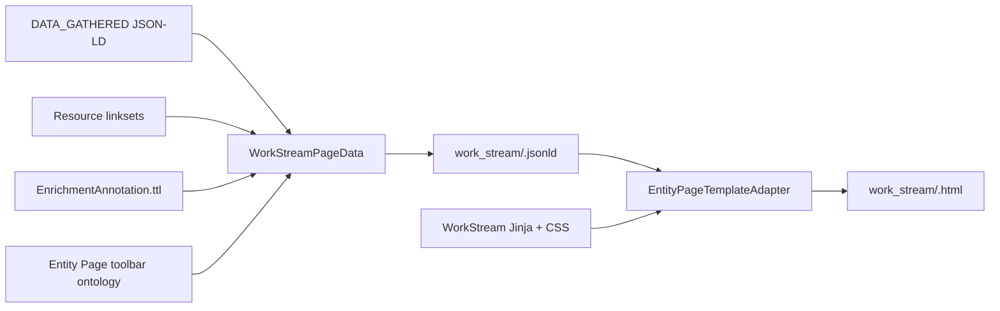

# WorkStream Entity Page

The WorkStream Entity Page is a generated, offline, read-only projection of one WorkStream Page-data JSON-LD document. All entity and relationship data is resolved during `ontobdc view`; opening the resulting HTML does not connect to a folder, parse a workbook, or rebuild the page from an external data source.

## Generation contract



The Page-data builder preserves the WorkStream source node, including its `@id`, `@type`, title, identifier, description, and dimension properties. It then adds the presentation data required by the template:

- the ordered seven-dimension model;
- the resource graph from the Surface `DATA_GATHERED` artifact;
- related and suggested resource identifiers resolved from WorkStream linksets;
- persisted enrichment annotations associated with the WorkStream dimensions;
- the ontology-backed Entity Page toolbar configuration.

The completed JSON-LD is the only data document consumed by HTML publication. `EntityViewsPublishedCapability` reads it and passes the complete payload to `EntityPageTemplateAdapter`; Jinja writes the visible values and resource regions directly into the HTML.

## Page regions

The generated document contains:

1. the shared Entity Page header, localized breadcrumb, and ontology-backed toolbar;
2. the WorkStream name, identifier, and description;
3. one card for each 5W2H dimension: What, Why, Who, Where, When, How, and How Much;
4. Related, Suggested, and Found resource panels inside each dimension card;
5. an offline preview area for images and PDFs, with a direct-open fallback for other resource types;
6. read-only enrichment annotation details associated with each resource.

Resource tabs and preview selection use a small inline DOM behavior. That script only changes visibility inside HTML that has already been generated; it does not fetch Page data or mutate the container.

## Read-only behavior

The generated Page deliberately has no folder-connection flow. It does not load the legacy connection, IndexedDB, SheetJS, Pyodide, workbook-writing, or linkset-writing runtimes.

Mutation controls are unavailable:

- name, description, and dimension values are plain rendered text;
- relation and suggestion status is displayed but cannot be changed;
- annotation creation controls are disabled;
- toolbar actions that depended on a connected folder or workbook are not placed on the WorkStream toolbar;
- the refresh action reloads the already generated Page.

To reflect changed source data, regenerate the View with `ontobdc view`. The Page is a published artifact, not an editor for its source graph.

## Files

| Responsibility | Location in `ontobdc-view` |
| --- | --- |
| Page-data state machine | `page/plugin/builder/work_stream/work_stream_page_data.yaml` |
| State adapter and handler | `page/plugin/builder/work_stream/work_stream.py` |
| WorkStream relation/read-model capability | `page/plugin/capability/transformation/work_stream_related_entities_resolved.py` |
| Generic template adapter | `page/adapter/template.py` |
| WorkStream template | `page/plugin/asset/entity/work_stream_view/work_stream_view.html.j2` |
| WorkStream styles | `page/plugin/asset/entity/work_stream_view/work_stream_view.css` |
| Toolbar model | `brasidatacenter/ontology/tool/ontobdc/abox/entity_page.ttl` |

## Generated files

```text
<container>/.__ontobdc__/view/work_stream/
├── <identifier>.jsonld
├── <identifier>.html
└── i18n_apply.js
```

The JSON-LD remains embedded in the HTML as `#ontobdc-page-jsonld` for semantic inspection and downstream consumers, even though the visible DOM has already been materialized by Jinja.

## Verification

`test_entity_views_published.py::test_work_stream_html_is_fully_materialized_from_page_data_jsonld` protects the static-publication contract. It verifies that the generated HTML already contains the entity header, description, dimension value, resource, annotation, and disabled annotation-creation action.

See also [Page generation architecture](../../03-architecture/page-generation.md), [WorkStream Page data](../04-state-machines/work-stream-page-data.md), and [Entity Views Published](../02-capabilities/surface/transformation/entity-views-published.md).
