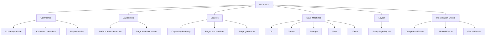

  <a href="../index.md"><kbd>↑ Back to Documentation</kbd></a>

# Reference

This section contains the **exact technical reference** for OntoBDC behavior.

Use it when you already know what concept or subsystem you are dealing with and need to answer questions such as:

- Which capability is responsible for a transformation?
- Which stable capability ID is used at runtime?
- Which event names and promotion rules are currently declared?
- Which loader discovers a given implementation?
- Which states belong to a process and in what order?
- Which generated artifacts or layout contracts are expected?
- Which repository, ontology, package, or implementation is the current source of truth?

Unlike **Concepts**, which defines meaning, and **Architecture**, which explains organization and runtime relationships, Reference documents the current executable contracts as precisely as possible.

## Reference map

## Sections

### 1. [Commands](01-commands/index.md)

Reference for the CLI entry surface: the commands published by each logical component and the rules that resolve one of them from an argument vector.

Command documentation should identify the stable `METADATA.id`, the owning logical component, the accepted arguments and their usage strings, the declared `depends_on` preconditions, and the process the command hands control to.

Commands are discovered under the same plugin convention as capabilities, so adding one normally requires no edit to a central registration table.

Start here: **[Command reference](01-commands/index.md)**.

### 2. [Capabilities](02-capabilities/index.md)

Reference for independently discoverable OntoBDC operations and transformations.

The current View runtime contains two important capability families:

- **Surface transformations** — build, validate, package, and publish the offline Presentation Surface;
- **Page transformations** — gather data for one entity Page and generate Page-owned browser assets.

Capability documentation should identify the stable `METADATA.id`, inputs, outputs, side effects, checks, source implementation, and the process state that owns the capability whenever those relationships exist.

Start here: **[Capability reference](02-capabilities/index.md)**.

### 3. [Loaders](03-loader/index.md)

Reference for the mechanisms that discover and resolve executable OntoBDC implementations.

Current loader documentation includes:

- **[Capability Loader](03-loader/capability-loader.md)** — discovers capabilities by stable metadata identity;
- **[Entity Page Data Handler Loader](03-loader/entity-page-generation-data-handler-loader.md)** — resolves the Page-data builder associated with an entity type;
- **[Entity Page Script Generator Loader](03-loader/entity-page-script-generator-loader.md)** — resolves entity-specific browser script generators.

Loader documentation should distinguish **discovery policy** from the capabilities or handlers being discovered. A loader locates an implementation; it does not own the business operation performed by that implementation.

### 4. [State Machines](04-state-machines/index.md)

Reference catalog for OntoBDC processes represented as explicit state machines.

The catalog currently spans several runtime areas:

| Area | Examples |
| --- | --- |
| CLI | initialization, health |
| Context | entity learning, entity analysis, document import |
| Storage | container create, dataset create, container update, container attach |
| View | Surface generation, Page-data generation, script generation, Global Event processing |
| dDock | event promotion |

Each machine reference should document the process-state type, ordered states, transition implementation, capability ownership, observable artifacts, failure behavior, and implementation status.

Start here: **[State machine reference](04-state-machines/index.md)**.

### 5. [Layout](05-layout/index.md)

Reference for generated presentation structure and entity-specific layout contracts.

Layout documentation records the shape expected by generated Pages and Surfaces without conflating that structure with the capabilities that generate it.

Current material includes the **[WorkStream Entity Page](05-layout/work-stream-entity-page.md)** layout reference.

### 6. [Presentation Events](06-events/index.md)

Reference for the concrete semantic event contract currently declared for OntoBDC View.

This includes:

- `ComponentEvent` definitions;
- `SharedEvent` definitions;
- `GlobalEvent` persistence and replay contracts;
- Component-to-Shared promotion relationships;
- canonical browser event envelopes;
- journal representation used by persisted Global Events;
- current implementation and ontology sources of truth.

Promotion behavior is ontology-driven. The reference records that policy, but the ontology remains the executable source of truth.

Start here: **[Presentation event reference](06-events/index.md)**.

## How to use this section

A useful rule is:

| Question | Go to |
| --- | --- |
| **What does this term mean?** | [Concepts](../02-concepts/index.md) |
| **Why is the system organized this way?** | [Architecture](../03-architecture/) |
| **How do I perform this task?** | [Guides](../04-guides/) |
| **What exactly does the current implementation do?** | **Reference** |
| **Why was this architectural choice made?** | [Architecture Decision Records](../03-architecture/adr/) |

## Source-of-truth principle

Reference documentation should stay as close as possible to the executable source of truth.

Depending on the subject, that source may be:

- Python implementation code;
- YAML statecharts;
- RDF/OWL ontologies and ABoxes;
- package metadata such as `METADATA.id`;
- generated artifact contracts;
- explicit transition tables used by browser-embedded runtimes.

When documentation and implementation disagree, the discrepancy must be made explicit rather than hidden behind a normalized description. If a capability is a stub, a state is not yet observable, or code has not yet been migrated into the released package, the reference should say so.

## Scope of this section

Reference should answer **“What is the precise current contract?”**

It should not become a conceptual tutorial, architectural essay, or task-oriented walkthrough. Those concerns belong to the other documentation sections and should be linked rather than duplicated.
